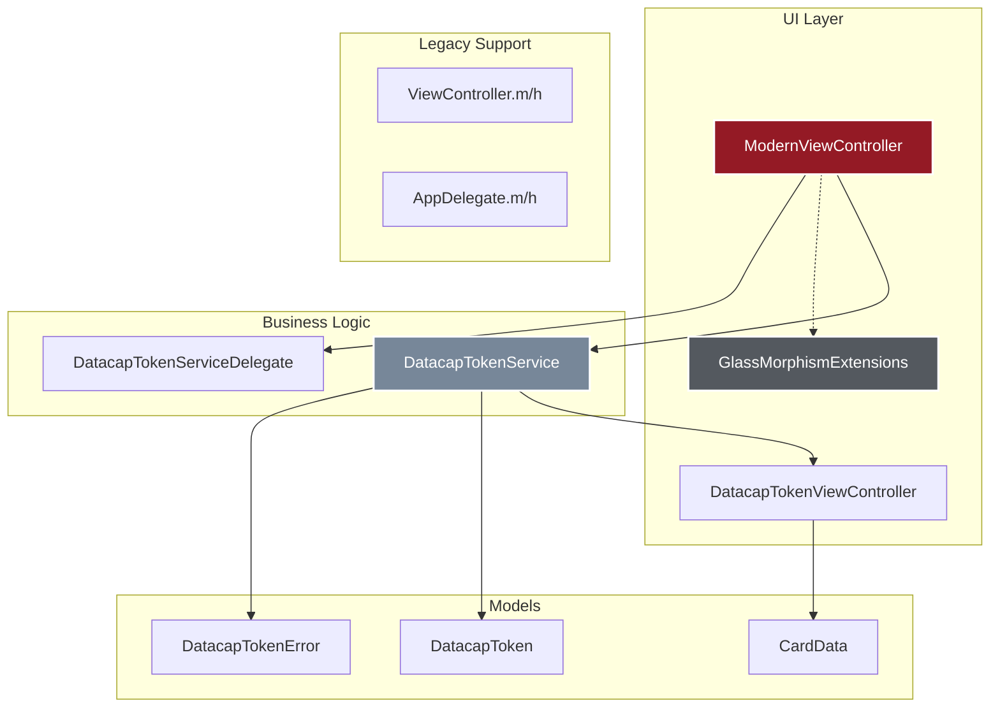
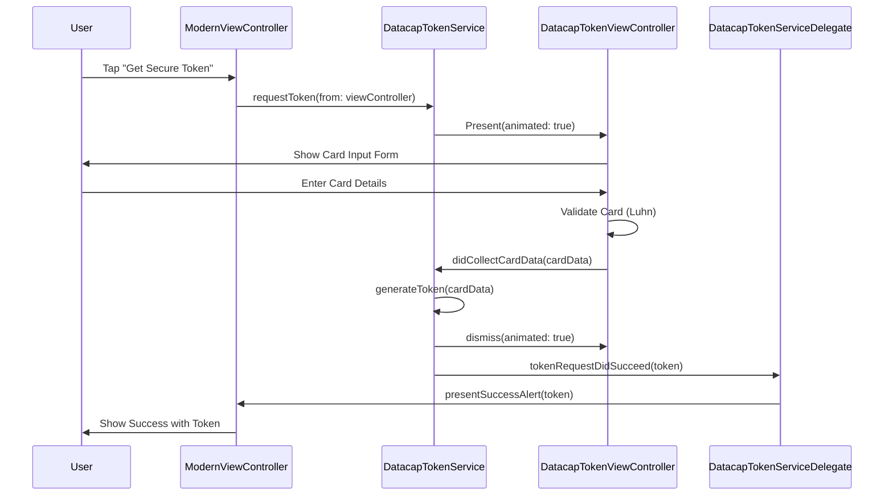

# CLAUDE.md - AI Development Assistant Guide

This file contains important information for AI assistants (like Claude) working on the Datacap Token iOS project.

## Project Overview

**Project Type**: iOS Mobile Application  
**Languages**: Swift 5.0+ and Objective-C  
**Framework**: Pure Swift Implementation (replaced legacy SDK)  
**UI Design**: iOS 26 Liquid Glass (Glass Morphism)  
**Target**: App Store Ready Demo Application  
**Status**: Complete with modern UI, ready for testing and deployment  
**Repository**: https://github.com/datacapsystems/Datacap-MobileToken-iOS-2025  

## Recent Updates (2025)

- ✅ Replaced problematic DatacapMobileToken.xcframework with pure Swift implementation
- ✅ Created `DatacapTokenService.swift` for tokenization functionality
- ✅ Implemented iOS 26 Liquid Glass design system
- ✅ Created `ModernViewController.swift` with programmatic UI
- ✅ Added `GlassMorphismExtensions.swift` for reusable effects
- ✅ Updated for App Store submission requirements
- ✅ Created automated build scripts
- ✅ Comprehensive documentation added

## Architecture Overview



## Key Development Guidelines

### 1. Code Style and Standards

- **Swift**: Use modern Swift 5.0+ features, optionals, and type safety
- **Objective-C**: Maintain compatibility with existing framework
- **UI**: Build programmatically using UIKit, avoid Storyboard for new features
- **Naming**: Follow Apple's API Design Guidelines
- **Comments**: Minimal inline comments, code should be self-documenting

### 2. Design System

#### Colors (from Datacap brand)
```swift
Primary Red: #941a25
Dark Gray: #54595f  
Blue Gray: #778799
Near Black: #231f20
Light Background: #f6f9fc
```

#### Glass Morphism Parameters
- Blur intensity: 0.85-0.95
- Corner radius: 16-24px
- Shadow opacity: 0.05-0.20
- Border: 0.5px @ 20% opacity white

### 3. Project Structure

```
Datacap-MobileToken-iOS-2025/
├── DatacapMobileTokenDemo/
│   ├── DatacapMobileDemo/
│   │   ├── AppDelegate.m/h (Objective-C app lifecycle)
│   │   ├── ViewController.m/h (Legacy Objective-C - kept for compatibility)
│   │   ├── ModernViewController.swift (Main UI)
│   │   ├── DatacapTokenService.swift (Tokenization logic)
│   │   ├── GlassMorphismExtensions.swift (UI extensions)
│   │   ├── DatacapMobileDemo-Bridging-Header.h (Swift/ObjC bridge)
│   │   └── Assets.xcassets/
│   ├── DatacapMobileToken.xcframework/ (Legacy - no longer used)
│   └── DatacapMobileTokenDemo.xcodeproj/
├── README.md (Updated with build instructions)
├── CLAUDE.md (This file)
├── APP_STORE_SUBMISSION.md (Submission guide)
├── TROUBLESHOOTING.md (Common issues)
├── build-and-install.sh (Automated build script)
└── fix-xcode-license.sh (License fix script)
```

### 4. Key Implementation Details

#### New Swift Implementation Flow



#### Swift/Objective-C Bridge
```objc
// DatacapMobileDemo-Bridging-Header.h
// Only imports Objective-C view controller now
#import "ViewController.h"
```

#### Main Components

##### DatacapTokenService.swift
- Pure Swift implementation replacing the framework
- Handles tokenization logic
- Card validation (Luhn algorithm)
- Card type detection
- Mock token generation for demo

##### ModernViewController.swift
- Primary UI implementation
- Programmatic UI only, no Storyboard elements
- Implements `DatacapTokenServiceDelegate` protocol
- Features glass morphism design with animations

##### DatacapTokenViewController.swift
- Card input form UI
- Built-in validation
- Keyboard handling
- Secure text entry for CVV

##### GlassMorphismExtensions.swift
- Reusable glass effects
- `UIView.applyLiquidGlass()` - Main glass morphism method
- `UIButton.applyDatacapGlassStyle()` - Branded button styling
- `LiquidGlassLoadingView` - Custom loading indicator

### 5. Build and Testing

#### Automated Scripts
```bash
# Fix Xcode license issues
./fix-xcode-license.sh

# Build and install (interactive menu)
./build-and-install.sh

# Direct commands
xcodebuild -project DatacapMobileTokenDemo/DatacapMobileTokenDemo.xcodeproj \
  -scheme DatacapMobileTokenDemo \
  -destination 'platform=iOS Simulator,name=iPhone 16 Pro' \
  build
```

#### Manual Build Steps
1. Open Xcode: `open DatacapMobileTokenDemo/DatacapMobileTokenDemo.xcodeproj`
2. Select team for code signing
3. Press ⌘+R to build and run

#### Testing Cards
- Visa: `4111111111111111`
- Mastercard: `5555555555554444`
- Amex: `378282246310005`
- Expiry: Any future date
- CVV: Any 3 digits

### 6. Common Tasks

#### Add New UI Component
1. Create extension in `GlassMorphismExtensions.swift`
2. Apply glass morphism effects consistently
3. Use Datacap color palette
4. Add haptic feedback for interactions

#### Update Token Integration
1. Modify in `DatacapTokenService.swift`
2. Implement delegate methods properly
3. Handle all error cases
4. Show appropriate UI feedback

#### Prepare for App Store
1. Update version in project settings
2. Verify Info.plist privacy descriptions
3. Test on multiple devices
4. Create screenshots at required sizes
5. Archive with Release configuration

### 7. Important Files to Check

When making changes, always verify:
- `Info.plist` - App configuration and privacy settings
- `ModernViewController.swift` - Main functionality
- `DatacapTokenService.swift` - Tokenization logic
- `GlassMorphismExtensions.swift` - UI consistency
- `DatacapMobileDemo-Bridging-Header.h` - Framework imports
- `Main.storyboard` - Set to use ModernViewController

### 8. Security Considerations

- Never commit real API keys or credentials
- Use test/demo keys in code examples
- Always use `isCertification: true` for demos
- No logging of sensitive payment data
- Current demo key: `cd67abe67d544936b0f3708b9fda7238`

### 9. Performance Guidelines

- Minimize view hierarchy depth
- Cache glass morphism layers
- Use lazy loading for heavy UI elements
- Profile with Instruments before release
- Test on older devices (iPhone X minimum)

### 10. Git Workflow

```bash
# Check status
git status

# Add changes
git add -A

# Commit with descriptive message
git commit -m "feat: Replace framework with pure Swift implementation

- Create DatacapTokenService for tokenization
- Remove dependency on DatacapMobileToken.xcframework
- Add card validation and type detection
- Implement mock token generation for demo

🤖 Generated with Claude Code

Co-Authored-By: Claude <noreply@anthropic.com>"

# Push to remote
git push origin main
```

### 11. Troubleshooting

#### Common Issues

1. **Swift Types Not Found**
   - Ensure all Swift files are in `DatacapMobileDemo` directory
   - Check that files are included in target membership
   - Clean build: ⌘+Shift+K

2. **Module 'DatacapMobileToken' not found**
   - This is expected - we removed the framework
   - Use `DatacapTokenService` instead

3. **Code Signing Errors**
   - Select team in Signing & Capabilities
   - Use personal Apple ID if no developer account
   - Delete app from device after 7 days (free accounts)

4. **Build Succeeds but Crashes**
   - Check deployment target is iOS 13.0+
   - Verify all Swift files are compiled
   - Check console for specific errors

#### Debug Commands
```bash
# Clean all
rm -rf ~/Library/Developer/Xcode/DerivedData
rm -rf build/

# Reset simulator
xcrun simctl erase all

# Check environment
xcode-select -p
swift --version
xcodebuild -version
```

### 12. Testing Checklist

Before any significant changes:
- [ ] Build succeeds without warnings
- [ ] App launches on simulator
- [ ] Glass morphism effects render correctly
- [ ] Token generation works
- [ ] Card validation functions properly
- [ ] Error handling shows proper alerts
- [ ] Memory usage is reasonable
- [ ] No crashes on device rotation
- [ ] Animations are smooth (60fps)

### 13. Future Enhancements

Consider these for future updates:
- SwiftUI migration for iOS 17+
- Real API integration (replace mock)
- Dynamic Island support
- Apple Pay integration
- Biometric authentication
- Accessibility improvements (VoiceOver)
- Dark mode refinements
- Widget extension
- Apple Watch companion app

### 14. Resources

- [Datacap API Docs](https://docs.datacapsystems.com)
- [iOS Human Interface Guidelines](https://developer.apple.com/design/human-interface-guidelines/)
- [Swift Style Guide](https://google.github.io/swift/)
- [App Store Review Guidelines](https://developer.apple.com/app-store/review/guidelines/)
- [Glass Morphism Design](https://uxdesign.cc/glassmorphism-in-user-interfaces-1f39bb1308c9)

## Notes for AI Assistants

### DO's
1. **Always test code changes** before committing
2. **Maintain consistent UI** using the glass morphism extensions
3. **Follow existing patterns** in the codebase
4. **Consider App Store requirements** in all changes
5. **Keep security as top priority** for payment handling
6. **Use the automated scripts** when possible
7. **Update documentation** when adding features

### DON'Ts
1. **Don't create new storyboard files** - use programmatic UI
2. **Don't add external dependencies** without discussion
3. **Don't log sensitive payment information**
4. **Don't remove legacy code** without understanding dependencies
5. **Don't change the bundle identifier** without updating docs

### Quick Reference

**Test Tokenization:**
1. Tap "Get Secure Token"
2. Enter: 4111111111111111
3. Expiry: 12/25, CVV: 123
4. See token response

**Fix Common Issues:**
```bash
./fix-xcode-license.sh     # License issues
./build-and-install.sh     # Choose option 3
```

**Key Files:**
- UI: `ModernViewController.swift`
- Logic: `DatacapTokenService.swift`
- Styling: `GlassMorphismExtensions.swift`
- Config: `Info.plist`
- Docs: `README.md`, `APP_STORE_SUBMISSION.md`

Remember: This is a demo app showcasing Datacap's technology. It should be impressive, functional, and ready for App Store submission while maintaining enterprise-grade code quality.