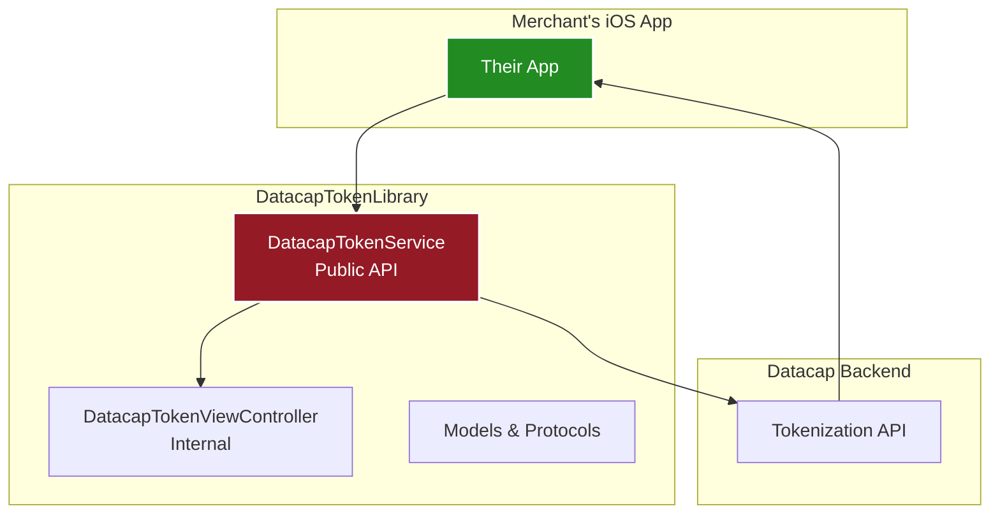
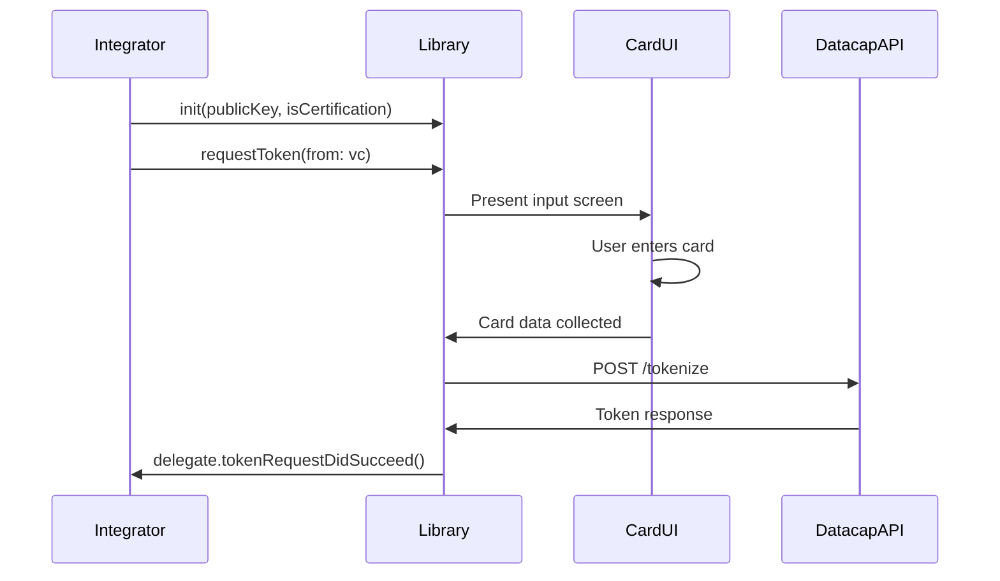

# CLAUDE.md - AI Development Assistant Guide

This file contains important information for AI assistants (like Claude) working on the Datacap Token iOS project.

## Project Overview

**Project Type**: iOS Mobile Token App + SDK Library  
**Languages**: Swift 5.0+  
**Framework**: Datacap Tokenization REST API  
**UI Design**: iOS 26 Liquid Glass (Glass Morphism)  
**Target**: Enterprises, ISVs, and Merchants requiring PCI compliance  
**Status**: Production app (v1.4) - Not a demo  
**Repository**: https://github.com/datacapsystems/Datacap-MobileToken-iOS-2025  
**App Store**: Datacap Mobile Token (pending approval)  

## Recent Updates (2025)

### Version 1.4 Release (June 2025)
- **Enhanced Dark Mode**: Complete overhaul with improved contrast and visibility
- **Adaptive Logo**: Logo inverts to white in dark mode for professional appearance
- **Dynamic UI Elements**: All components now properly adapt to light/dark mode
- **Improved Accessibility**: Better contrast ratios throughout the app
- **Menu Pill Updates**: Enhanced visibility with adaptive backgrounds and shadows
- **Settings Screen**: Dark mode optimizations for all form elements
- **Button Polish**: Brighter reds with subtle borders in dark mode

### Version 1.3 Release (June 2025)
- **Glass Morphism Consistency**: Fixed iPhone to match iPad's glass container design
- **UI Polish**: Unified visual appearance across all devices
- **App Store Build**: Version 1.3 (build 3) ready for distribution
- **Updated Marketing**: Refined App Store description to accurately reflect features
- **Security Clarification**: API keys stored in UserDefaults (no biometric protection)
- **Bug Fixes**: Various UI improvements and consistency updates

### App Store Positioning (v1.2 - June 2025)
- **Removed all "demo" references**: Now "Datacap Mobile Token" 
- **Enterprise focus**: Emphasizes PCI compliance benefits (90% reduction)
- **Professional messaging**: Highlights 35+ years of payment innovation
- **Dual environment positioning**: Certification and production for real-world use
- **Value propositions**: Cross-platform tokenization, processor independence
- **Updated help content**: Enterprise-focused documentation

### Production API Integration
- **Fixed tokenization endpoints**: Now using correct `/v1/otu` endpoints
- **Proper authentication**: Token key in Authorization header
- **Correct request format**: Capitalized field names (Account, ExpirationMonth, etc.)
- **Dual key support**: Separate keys for certification and production environments
- **Migration support**: Automatic upgrade from single-key to dual-key system
- **Two integration modes**: Built-in UI or custom UI with `generateTokenDirect()`

### SDK Architecture
- **Single-file integration**: Just copy `DatacapTokenService.swift`
- **Zero dependencies**: Pure Swift, no external libraries
- **Delegate pattern**: Async responses via protocol
- **Error handling**: Typed errors with clear descriptions
- **Card validation**: Luhn algorithm, BIN detection, format validation

### UI/UX Implementation
- **iOS 26 Liquid Glass**: Modern glass morphism design
- **Programmatic UI**: No storyboards for new features
- **Smart card entry**: Auto-formatting, type detection
- **Native date picker**: Wheel-style expiration selection
- **Settings management**: Separate keys for each environment
- **Professional UI text**: No testing/demo language
- **Floating Menu Pill**: iOS 26-style navigation with expandable actions
- **Fixed-width design**: Consistent 260pt width for menu stability

### Repository Cleanup (June 2025)
- **Public-facing structure**: Cleaned for open source distribution
- **MIT License**: Added for broad usage rights
- **Private files moved**: All internal scripts and docs in `.backup-private/`
- **Professional documentation**: README with working Mermaid diagrams
- **Clean git history**: Ready for public repository

### iOS 26 Redesign (June 2025)
- **Floating Menu Pill**: Modern navigation with fixed 260pt width
- **Dual Environment Toggle**: Visual mode switching in floating menu
- **Enhanced Help System**: Full-screen overlay with professional content
- **Permanent Expansion**: Menu always visible for better UX
- **Glass Morphism**: Consistent visual effects throughout
- **Responsive Layout**: Optimized for all iPhone and iPad sizes

### iPad Optimization (June 2025)
- **Full Screen Usage**: 800pt wide container on iPad vs narrower on iPhone
- **Dynamic Typography**: Titles 48pt on iPad (28pt iPhone), subtitles 26pt (18pt iPhone)
- **Feature Cards**: Three informational cards displayed on iPad below main content
- **Improved Spacing**: Larger padding and margins throughout for better iPad layout
- **Device Detection**: `configureForDevice()` method adjusts UI based on device type
- **Card Text Display**: Full descriptions visible without truncation on feature cards
- **Professional Layout**: Makes effective use of iPad's larger screen real estate
- **Settings Screen Typography**: API Configuration uses 48pt title, 20pt labels, 18pt text fields
- **Consistent Font Scaling**: All screens now use proportionally larger fonts on iPad

### Dark Mode Support (June 2025)
- **Dynamic Color System**: All colors adapt automatically to light/dark mode
- **Trait Collection Handling**: `traitCollectionDidChange` updates UI when mode switches
- **Adaptive Backgrounds**: Form backgrounds change from white to dark gray (#2c2c2e)
- **Text Contrast**: Text colors invert for optimal readability in each mode
- **Glass Morphism**: Blur effects adapt using appropriate styles for each mode
- **No Hard-Coded Colors**: All UI uses dynamic colors from `UIColor.Datacap` extensions
- **Accessibility**: High contrast maintained in both light and dark modes
- **Smooth Transitions**: Colors update seamlessly when switching modes

## Repository Structure

```
Datacap-MobileToken-iOS-2025/
├── DatacapTokenLibrary/              # 📦 DISTRIBUTABLE LIBRARY
│   ├── Sources/                      # Library source code
│   │   ├── DatacapTokenService.swift # Public API
│   │   └── DatacapTokenViewController.swift # Internal UI
│   ├── Example/                      # Integration examples
│   ├── Tests/                        # Unit tests
│   ├── Package.swift                 # SPM configuration
│   ├── DatacapTokenLibrary.podspec  # CocoaPods spec
│   └── README.md                     # Library documentation
│
├── DatacapMobileTokenDemo/           # 📱 DEMO APPLICATION
│   ├── DatacapMobileDemo/
│   │   ├── ModernViewController.swift      # Demo main screen
│   │   ├── SettingsViewController.swift    # API configuration
│   │   ├── HelpOverlayView.swift          # iOS 26 help overlay
│   │   ├── FloatingMenuPill.swift          # iOS 26 floating navigation
│   │   ├── DatacapTokenService.swift       # Same as library
│   │   └── GlassMorphismExtensions.swift   # UI styling
│   └── DatacapMobileTokenDemo.xcodeproj
│
├── docs/                             # 📚 PUBLIC DOCUMENTATION
│   └── images/                       # Screenshots and diagrams
│
├── README.md                         # Main repository documentation
├── INTEGRATION_GUIDE.md              # Detailed integration guide
├── LICENSE                           # MIT License
├── CLAUDE.md                         # This file (AI assistant guide)
└── .gitignore                        # Excludes private files
```

## Architecture Overview

### Library Architecture (What Integrators Use)



### Integration Flow



## Key Development Guidelines

### 1. Library Philosophy

- **Minimal Surface Area**: Only expose what's necessary
- **Zero Dependencies**: No external libraries
- **Production Ready**: No mock data, real API only
- **Stateless Design**: No data persistence
- **Easy Integration**: 3 lines to get started

### 2. Public API (What Integrators See)

```swift
// Main service class
public class DatacapTokenService {
    public init(publicKey: String, isCertification: Bool, apiEndpoint: String?)
    public func requestToken(from: UIViewController)
    public weak var delegate: DatacapTokenServiceDelegate?
}

// Delegate protocol
public protocol DatacapTokenServiceDelegate {
    func tokenRequestDidSucceed(_ token: DatacapToken)
    func tokenRequestDidFail(error: DatacapTokenError)
    func tokenRequestDidCancel()
}

// Response model
public struct DatacapToken {
    public let token: String
    public let maskedCardNumber: String
    public let cardType: String
    public let expirationDate: String
    public let responseCode: String
    public let responseMessage: String
    public let timestamp: Date
}
```

### 3. Internal Components (Hidden from Integrators)

- `DatacapTokenViewController` - Card input UI
- Card validation logic
- Network implementation
- Card formatting logic

### 4. Distribution Channels

#### Swift Package Manager
```swift
.package(url: "https://github.com/datacapsystems/DatacapTokenLibrary-iOS.git", from: "1.0.0")
```

#### CocoaPods
```ruby
pod 'DatacapTokenLibrary', '~> 1.0'
```

#### Manual
- Copy `Sources/` folder
- Add to Xcode project

### 5. Security Requirements

- **No Logging**: Never log card numbers or sensitive data
- **HTTPS Only**: Enforce TLS for all API calls
- **Input Validation**: Client-side Luhn validation
- **No Storage**: Never persist card data
- **API Key Security**: Integrators must secure their keys

### 6. Testing Guidelines

#### For Library Development
```bash
cd DatacapTokenLibrary
swift test
```

#### For App Testing
```bash
xcodebuild test -project DatacapMobileTokenDemo/DatacapMobileTokenDemo.xcodeproj \
  -scheme DatacapMobileToken \
  -destination 'platform=iOS Simulator,name=iPhone 16 Pro'
```

### 7. Common Development Tasks

#### Update Library Version
1. Update version in `Package.swift`
2. Update version in `DatacapTokenLibrary.podspec`
3. Tag release in git
4. Update documentation

#### Add New Card Type
1. Update detection in `DatacapTokenService.swift`
2. Add formatting in `DatacapTokenViewController.swift`
3. Update CVV validation
4. Add test cases
5. Update documentation

#### Fix UI Issues
1. Make changes in library `Sources/`
2. Test in demo app
3. Ensure backward compatibility
4. Update integration examples

### 8. Build & Release Process

```bash
# 1. Test library
cd DatacapTokenLibrary
swift test

# 2. Test app
cd ..
xcodebuild -project DatacapMobileTokenDemo/DatacapMobileTokenDemo.xcodeproj build

# 3. Tag release
git tag -a v1.0.0 -m "Release version 1.0.0"
git push origin v1.0.0

# 4. Update package repositories
# - Submit to CocoaPods trunk
# - SPM updates automatically from git tag
```

### 9. Integration Support

When helping integrators:

1. **Always reference the library README** first
2. **Provide minimal code examples**
3. **Test with their specific use case**
4. **Never suggest modifications to library internals**
5. **Document any issues for future releases**

## Current Status

### Library Package (`/DatacapTokenLibrary/`)
- Core tokenization service
- Card input UI
- Real API integration
- SPM and CocoaPods ready
- Documentation complete
- MIT License (entire repository)

### Mobile Token App (`/DatacapMobileTokenDemo/`)
- Shows library integration
- Settings for API configuration
- Glass morphism UI
- Help documentation
- Ready for App Store
- iOS 26 floating menu navigation
- Fixed-width pill design (260pt)
- Production positioning

### Repository Status
- Public-facing structure
- Professional documentation
- Clean commit history
- Private files backed up in `.backup-private/`
- Ready for GitHub public repository

## UI/UX Best Practices

### Color Management
1. **Always use dynamic colors** from `UIColor.Datacap` extensions
2. **Never hardcode RGB values** except for brand colors (primaryRed)
3. **Test in both light and dark modes** before committing
4. **Use semantic naming** (formBackground, formText, etc.)

### Responsive Design
1. **Check device type** with `UIDevice.current.userInterfaceIdiom`
2. **Use `configureForDevice()`** method pattern for dynamic sizing
3. **Test on all device sizes**: iPhone SE, iPhone Pro Max, iPad Pro
4. **Maintain touch targets**: Minimum 44pt for buttons

### Typography Guidelines
- **iPhone**: Base title 28pt, body 15-17pt
- **iPad**: Base title 48pt, body 18-22pt
- **Always scale proportionally** across all UI elements
- **Use system fonts** with appropriate weights

### Glass Morphism Rules
1. **Adapt blur style** based on trait collection
2. **Maintain readability** over aesthetic effects
3. **Use subtle shadows** (0.05-0.2 opacity)
4. **Keep corner radius consistent** (16-32pt)

## Notes for AI Assistants

### DO's
1. **Keep library minimal** - Don't add unnecessary features
2. **Maintain backward compatibility** - Don't break existing integrations
3. **Document all changes** - Update README and migration guides
4. **Test thoroughly** - Both library and demo app
5. **Focus on security** - This handles payment data
6. **Use semantic versioning** - Major.Minor.Patch

### DON'Ts
1. **Don't add external dependencies** - Keep it zero-dependency
2. **Don't expose internals** - Keep implementation details private
3. **Don't add mock/demo modes** - Production use only
4. **Don't log sensitive data** - No card numbers in logs
5. **Don't complicate integration** - Keep it simple
6. **Don't modify without testing** - Always verify changes

### Quick Commands

```bash
# Open demo in Xcode
open DatacapMobileTokenDemo/DatacapMobileTokenDemo.xcodeproj

# Build library
cd DatacapTokenLibrary && swift build

# Run demo
xcodebuild -project DatacapMobileTokenDemo/DatacapMobileTokenDemo.xcodeproj \
  -scheme DatacapMobileToken \
  -destination 'platform=iOS Simulator,name=iPhone 16 Pro' \
  build

# Package library for distribution
cd DatacapTokenLibrary
swift build -c release
```

### Support Channels

- Library Issues: GitHub Issues
- Integration Support: support@datacapsystems.com
- Documentation: docs.datacapsystems.com
- Developer Portal: dsidevportal.com

Remember: The library is what merchants integrate. Keep it clean, secure, and simple. The app showcases capabilities and serves as a reference implementation for integrators.

## Private Files (.backup-private/)

The `.backup-private/` directory contains internal Datacap tools and documentation that are NOT part of the public SDK:

- App Store materials and descriptions
- Screenshot generation tools
- Build and deployment scripts
- Internal documentation
- Marketing assets

This directory is gitignored and should never be included in the public repository.

## API Integration Details

### Tokenization Endpoints
- **Certification**: `https://token-cert.dcap.com/v1/otu`
- **Production**: `https://token.dcap.com/v1/otu`

### Request Format
```http
POST /v1/otu
Authorization: {token-key}
Content-Type: application/json

{
    "Account": "4111111111111111",
    "ExpirationMonth": "12",
    "ExpirationYear": "25",
    "CVV": "123"
}
```

### Response Format
```json
{
    "Token": "DC4:AAAMbdJpMn6wZYlx84etCekz...",
    "Brand": "Visa",
    "ExpirationMonth": "12",
    "ExpirationYear": "2025",
    "Last4": "1111",
    "Bin": "411111"
}
```

## Key Storage

The app manages separate API keys for each environment using UserDefaults:

```swift
// Certification key
UserDefaults.standard.string(forKey: "DatacapCertificationPublicKey")

// Production key  
UserDefaults.standard.string(forKey: "DatacapProductionPublicKey")

// Legacy key (for backwards compatibility)
UserDefaults.standard.string(forKey: "DatacapPublicKey")

// Current mode
UserDefaults.standard.bool(forKey: "DatacapCertificationMode")
```

**Note**: API keys are stored in plain UserDefaults without encryption or biometric protection. Future versions should consider Keychain storage for enhanced security.

## Test Keys for Development

- **Certification Key**: `40e5d3b53da64750937728d783e4b3d1`
- **Production Key**: `6b8690b69c674b83927de02fdb4c5184`

Note: These are example keys. ISVs must obtain their own keys from dsidevportal.com