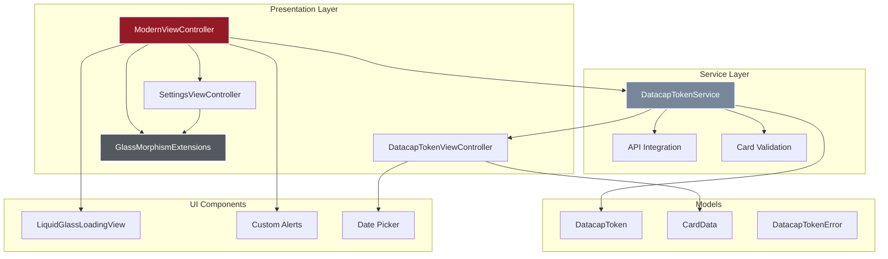

# CLAUDE.md - AI Development Assistant Guide

This file contains important information for AI assistants (like Claude) working on the Datacap Token iOS project.

## Project Overview

**Project Type**: iOS Mobile Application  
**Languages**: Swift 5.0+ and Objective-C  
**Framework**: Datacap MobileToken SDK  
**UI Design**: iOS 26 Liquid Glass (Glass Morphism)  
**Target**: App Store Ready Demo Application  
**Status**: Complete with modern UI, ready for testing and deployment  
**Repository**: https://github.com/datacapsystems/Datacap-MobileToken-iOS-2025  

## Recent Updates (2025)

- ✅ Implemented iOS 26 Liquid Glass design system
- ✅ Created `ModernViewController.swift` with programmatic UI
- ✅ Added `GlassMorphismExtensions.swift` for reusable effects
- ✅ Updated for App Store submission requirements
- ✅ Created automated build scripts
- ✅ Comprehensive documentation added
- ✅ Fixed button interaction issues
- ✅ Added real API integration with demo/production modes
- ✅ Created settings UI for API configuration
- ✅ Implemented smart card type detection and formatting
- ✅ Added date picker for expiration date input
- ✅ Enhanced error handling with proper view dismissal
- ✅ Customized button colors for visual hierarchy
- ✅ Fixed green checkmark color to forest green
- ✅ **Added Certification mode** (between Demo and Production)
- ✅ **Created TransactionViewController** for processing transactions with saved tokens
- ✅ **Implemented token saving** functionality with one-click reuse
- ✅ **Added configurable amount selector** with number pad for USD transactions
- ✅ **Integrated Pay API v2** for real transaction processing
- ✅ **Added help button** explaining app features and modes
- ✅ **Created App Store listing** positioning app for both existing and new customers
- ✅ **Fixed SavedToken compilation error** by moving struct to DatacapTokenService
- ✅ **Added TransactionViewController to Xcode project** via project.pbxproj edits
- ✅ **Enhanced help overlay readability** with better contrast and opacity
- ✅ **Updated mode indicator** from "CERT MODE" to "CERTIFICATION MODE"
- ✅ **Unified button styling** - Process Transaction matches Get Secure Token
- ✅ **Fixed token card display** - Increased width and added proper constraints

## Architecture Overview



## Key Development Guidelines

### 1. Code Style and Standards

- **Swift**: Use modern Swift 5.0+ features, optionals, and type safety
- **Objective-C**: Maintain compatibility with existing framework
- **UI**: Build programmatically using UIKit, avoid Storyboard for new features
- **Naming**: Follow Apple's API Design Guidelines
- **Comments**: Minimal inline comments, code should be self-documenting

### 2. Design System

#### Colors (from Datacap brand)
```swift
Primary Red: #941a25
Dark Red (CTA): #781425 (RGB: 120/20/30)
Forest Green: #228b22 (RGB: 34/139/34)
Dark Gray: #54595f  
Blue Gray: #778799
Near Black: #231f20
Light Background: #f6f9fc
```

#### Glass Morphism Parameters
- Blur intensity: 0.85-0.95
- Corner radius: 16-24px
- Shadow opacity: 0.05-0.20
- Border: 0.5px @ 20% opacity white

### 3. Project Structure

```
Datacap-MobileToken-iOS-2025/
├── DatacapMobileTokenDemo/
│   ├── DatacapMobileDemo/
│   │   ├── AppDelegate.m/h (Objective-C app lifecycle)
│   │   ├── ViewController.m/h (Legacy Objective-C - kept for compatibility)
│   │   ├── ModernViewController.swift (Main UI - ENHANCED with help & transactions)
│   │   ├── SettingsViewController.swift (API Settings - ENHANCED with 3 modes)
│   │   ├── TransactionViewController.swift (Transaction Processing - NEW)
│   │   ├── DatacapTokenService.swift (Token Service - ENHANCED with SavedToken)
│   │   ├── GlassMorphismExtensions.swift (UI extensions - NEW)
│   │   ├── DatacapMobileDemo-Bridging-Header.h (Swift/ObjC bridge)
│   │   └── Assets.xcassets/
│   ├── DatacapMobileToken.xcframework/ (SDK)
│   └── DatacapMobileTokenDemo.xcodeproj/
├── README.md (Updated with comprehensive docs)
├── CLAUDE.md (This file)
├── APP_STORE_SUBMISSION.md (Submission guide)
├── APP_STORE_LISTING.md (App Store description - NEW)
├── TROUBLESHOOTING.md (Common issues)
├── build-and-install.sh (Automated build script)
├── fix-xcode-license.sh (License fix script)
└── Various reload scripts (simple-reload.sh, etc.)
```

### 4. Key Implementation Details

#### Main View Controller
- `ModernViewController.swift` - Primary UI implementation
- Programmatic UI only, no Storyboard elements
- Implements `DatacapTokenServiceDelegate` protocol
- Features glass morphism design with animations
- Mode indicator (Demo/Live) with black background
- Settings button for API configuration
- Darker red (#781425) for primary CTA button

#### Settings View Controller
- `SettingsViewController.swift` - API configuration UI
- Glass morphism design matching main UI
- Demo/Production mode toggle
- API key and endpoint configuration
- Pre-filled endpoint with validation
- Save button uses dark red, mode selector uses lighter red
- Visual success feedback

#### Token Service
- `DatacapTokenService.swift` - Enhanced tokenization
- Supports both demo and production modes
- Real API integration capability
- Smart card type detection
- Dynamic formatting based on card type
- Proper error handling with view dismissal

#### Card Input View
- `DatacapTokenViewController.swift` - Card input UI
- Date picker for expiration (wheel style)
- Smart card number formatting
- Dynamic max length based on card type
- Real-time validation feedback
- Secure CVV entry

#### UI Extensions
- `GlassMorphismExtensions.swift` - Reusable glass effects
- `UIView.applyLiquidGlass()` - Main glass morphism method
- `UIButton.applyDatacapGlassStyle()` - Branded button styling
- `LiquidGlassLoadingView` - Custom loading indicator

### 5. Feature Implementation Details

#### Smart Card Detection
```swift
// Automatic card type detection
- Visa: Starts with 4 (16 digits, 4-4-4-4)
- Mastercard: 51-55, 2221-2720 (16 digits, 4-4-4-4)
- Amex: 34, 37 (15 digits, 4-6-5, CVV: 4 digits)
- Discover: 6011, 65, 644-649 (16 digits, 4-4-4-4)
- Diners: 36, 38, 300-305 (14 digits, 4-6-4)
```

#### Date Picker Integration
```swift
// Native iOS date picker for expiration
expirationDatePicker.datePickerMode = .date
expirationDatePicker.preferredDatePickerStyle = .wheels
expirationField.inputView = expirationDatePicker
```

#### API Integration
```swift
// Production mode with real endpoint
if !isDemoMode {
    tokenService = DatacapTokenService(
        publicKey: savedPublicKey,
        isCertification: true,
        apiEndpoint: savedEndpoint
    )
}
```

#### Visual Mode Indicators
- Demo Mode: Black background, white "DEMO MODE" text
- Live Mode: Black background, white "LIVE MODE" text
- Located top-left, aligned with settings button

### 6. Build and Testing

#### Automated Scripts
```bash
# Fix Xcode license issues
./fix-xcode-license.sh

# Build and install (interactive menu)
./build-and-install.sh

# Direct commands
xcodebuild -project DatacapMobileTokenDemo/DatacapMobileTokenDemo.xcodeproj \
  -scheme DatacapMobileTokenDemo \
  -destination 'platform=iOS Simulator,name=iPhone 16 Pro' \
  build
```

#### Manual Build Steps
1. Open Xcode: `open DatacapMobileTokenDemo/DatacapMobileTokenDemo.xcodeproj`
2. Set bridging header: `DatacapMobileDemo/DatacapMobileDemo-Bridging-Header.h`
3. Select team for code signing
4. Press ⌘+R to build and run

#### Testing Cards
- Visa: `4111111111111111`
- Mastercard: `5555555555554444`
- Amex: `378282246310005`
- Discover: `6011111111111117`
- Diners: `36700102000000`

### 7. Common Tasks

#### Add New UI Component
1. Create extension in `GlassMorphismExtensions.swift`
2. Apply glass morphism effects consistently
3. Use Datacap color palette
4. Add haptic feedback for interactions

#### Update Token Integration
1. Modify in `DatacapTokenService.swift`
2. Implement delegate methods properly
3. Handle all error cases
4. Show appropriate UI feedback
5. Dismiss card input before showing errors

#### Configure API Settings
1. Tap settings icon (top right)
2. Toggle between Demo/Production
3. Enter API key (min 32 chars for production)
4. Endpoint pre-filled with official URL
5. Save configuration

### 8. Important Files to Check

When making changes, always verify:
- `Info.plist` - App configuration and privacy settings
- `ModernViewController.swift` - Main functionality
- `SettingsViewController.swift` - API configuration
- `DatacapTokenService.swift` - Token logic
- `GlassMorphismExtensions.swift` - UI consistency
- `DatacapMobileDemo-Bridging-Header.h` - Framework imports
- `Main.storyboard` - Set to use ModernViewController

### 9. Security Considerations

- Never commit real API keys or credentials
- Use test/demo keys in code examples
- Always use `isCertification: true` for demos
- No logging of sensitive payment data
- Current demo key: `cd67abe67d544936b0f3708b9fda7238`
- API endpoint: `https://api.datacapsystems.com/v1/tokenize`

### 10. UI/UX Guidelines

#### Button Hierarchy
1. Primary CTA (Get Secure Token): Darkest red (#781425)
2. Secondary actions (Save): Dark red (#781425)
3. Mode selector: Lighter red with transparency
4. Cancel/Try Again: Standard Datacap red

#### Success States
- Checkmark: Forest green (#228b22)
- Background: Glass morphism
- Animation: Spring with scale

#### Error States
- Icon: Red exclamation triangle
- Background: Glass morphism
- Dismiss card input first

### 11. Git Workflow

```bash
# Check status
git status

# Add changes
git add -A

# Commit with descriptive message
git commit -m "feat: Add date picker for card expiration

- Replace text input with native iOS date picker
- Use wheel style for better UX
- Add toolbar with Done button
- Format output as MM/YY

🤖 Generated with Claude Code

Co-Authored-By: Claude <noreply@anthropic.com>"

# Push to remote
git push origin main
```

### 12. Troubleshooting

#### Common Issues

1. **Button Not Clickable**
   - Check view hierarchy order
   - Verify isUserInteractionEnabled
   - Remove glass morphism from interactive buttons
   - Check frame and bounds

2. **Error Alert Behind Card Input**
   - Dismiss card input view first
   - Then show error alert
   - Use completion handler

3. **Text Truncation**
   - Reduce font size
   - Adjust content insets
   - Check constraint priorities

4. **Date Picker Not Showing**
   - Ensure inputView is set
   - Check delegate methods
   - Verify field is first responder

5. **API Integration Issues**
   - Check endpoint URL format
   - Verify API key length
   - Test with demo mode first
   - Check network permissions

### 13. Testing Checklist

Before any significant changes:
- [ ] Build succeeds without warnings
- [ ] App launches on simulator
- [ ] Glass morphism effects render correctly
- [ ] Token generation works in demo mode
- [ ] Settings screen opens and saves
- [ ] Mode indicator updates correctly
- [ ] Date picker functions properly
- [ ] Card formatting works for all types
- [ ] Error handling shows proper alerts
- [ ] Memory usage is reasonable
- [ ] No crashes on device rotation
- [ ] Animations are smooth (60fps)

### 14. Asset Generation Scripts

The project includes several scripts for App Store asset generation:

#### App Icon Generator
```bash
./create-app-icon.swift
```
- Generates all 19 required icon sizes
- Creates programmatic icon with lock/card design
- Outputs to `AppIcons/` with Contents.json

#### Screenshot Scripts
```bash
./capture-screenshots-interactive.sh  # Interactive capture guide
./resize-screenshots.sh              # Resize to App Store dimensions
```
- Guides through capturing all required screens
- Resizes to 1290×2796px for iPhone 6.7"
- Saves to `AppStoreAssets/Screenshots/`

#### Asset Structure Generator
```bash
./generate-app-store-assets.sh
```
- Creates complete App Store asset directory structure
- Generates screenshot guides and checklists
- Creates marketing materials templates

### 15. Future Enhancements

Consider these for future updates:
- SwiftUI migration for iOS 17+
- Dynamic Island support
- Apple Pay integration
- Biometric authentication
- Accessibility improvements (VoiceOver)
- Dark mode refinements
- Widget extension
- Apple Watch companion app
- Internationalization support
- Analytics integration

### 16. Resources

- [Datacap API Docs](https://docs.datacapsystems.com)
- [Developer Portal](https://www.dsidevportal.com)
- [iOS Human Interface Guidelines](https://developer.apple.com/design/human-interface-guidelines/)
- [Swift Style Guide](https://google.github.io/swift/)
- [App Store Review Guidelines](https://developer.apple.com/app-store/review/guidelines/)
- [Glass Morphism Design](https://uxdesign.cc/glassmorphism-in-user-interfaces-1f39bb1308c9)

## Current Status & Next Steps

### Just Completed
1. **App Store Asset Generation (Latest Session)**
   - Generated all 19 app icon sizes using create-app-icon.swift
   - Created comprehensive screenshot capture scripts
   - Captured all 6 required screenshots (Home, Card Entry, Success, Settings, Help, Transaction)
   - Resized screenshots to App Store dimensions (1290×2796px)
   - Organized assets in AppStoreAssets directory structure
   - Created APP_STORE_ASSETS_SUMMARY.md with submission checklist
   - Started App Store Connect submission process

2. **UI/UX Improvements**
   - Enhanced help overlay readability with better contrast and color opacity
   - Renamed "CERT MODE" to "CERTIFICATION MODE" for consistency
   - Updated Process Transaction button to match Get Secure Token styling
   - Fixed token card width to prevent text cutoff
   - Added proper padding and constraints for token display
   
3. **Core Features Completed**
   - Added TransactionViewController.swift to Xcode project
   - Fixed "SavedToken not found" compilation error
   - Moved SavedToken struct to DatacapTokenService.swift
   - Manually edited project.pbxproj to include TransactionViewController

### App Features Now Implemented
1. **Three operation modes**: Demo, Certification, Production
2. **Token saving**: Automatically saves generated tokens for reuse
3. **Transaction processing**: Complete Pay API v2 integration
4. **Help system**: Comprehensive help overlay explaining modes
5. **App Store ready**: Complete listing and asset requirements

### To Resume Development
1. **Build and run the app**:
   ```bash
   cd DatacapMobileTokenDemo
   xcodebuild -project DatacapMobileTokenDemo.xcodeproj \
     -scheme DatacapMobileTokenDemo \
     -sdk iphonesimulator \
     -destination 'platform=iOS Simulator,name=iPhone 14 Pro' \
     build
   ```

2. **Install to simulator**:
   ```bash
   # Find built app
   APP_PATH=$(find ~/Library/Developer/Xcode/DerivedData -name "DatacapMobileTokenDemo.app" | head -1)
   
   # Install and launch
   xcrun simctl install booted "$APP_PATH"
   xcrun simctl launch booted com.datacapsystems.DatacapMobileTokenDemo
   ```

3. **Or open in Xcode**:
   ```bash
   open DatacapMobileTokenDemo/DatacapMobileTokenDemo.xcodeproj
   # Press ⌘+R to build and run
   ```

### Known Issues
- Build scripts having issues with bash shell context
- Simulator detection in scripts sometimes fails
- May need to manually open Xcode and run

## Notes for AI Assistants

### DO's
1. **Always test code changes** before committing
2. **Maintain consistent UI** using the glass morphism extensions
3. **Follow existing patterns** in the codebase
4. **Consider App Store requirements** in all changes
5. **Keep security as top priority** for payment handling
6. **Use the automated scripts** when possible
7. **Update documentation** when adding features
8. **Check visual hierarchy** for button prominence
9. **Test all user flows** end-to-end
10. **Build and push to simulator** when requested by user

### DON'Ts
1. **Don't create new storyboard files** - use programmatic UI
2. **Don't add external dependencies** without discussion
3. **Don't log sensitive payment information**
4. **Don't remove legacy code** without understanding dependencies
5. **Don't change the bundle identifier** without updating docs
6. **Don't use system colors** - use Datacap palette
7. **Don't skip error handling** - always provide feedback

### Quick Reference

**Test Tokenization:**
1. Tap "Get Secure Token"
2. Enter: 4111111111111111
3. Select expiry date with picker
4. Enter CVV: 123
5. Submit and see token

**Configure API:**
1. Tap settings icon
2. Toggle to Production
3. Enter API key
4. Save configuration

**Fix Common Issues:**
```bash
./fix-xcode-license.sh     # License issues
./build-and-install.sh     # Choose option 3
```

**Key Files:**
- UI: `ModernViewController.swift`
- Settings: `SettingsViewController.swift`
- Logic: `DatacapTokenService.swift`
- Styling: `GlassMorphismExtensions.swift`
- Config: `Info.plist`
- Docs: `README.md`, `APP_STORE_SUBMISSION.md`

Remember: This is a demo app showcasing Datacap's technology. It should be impressive, functional, and ready for App Store submission while maintaining enterprise-grade code quality.