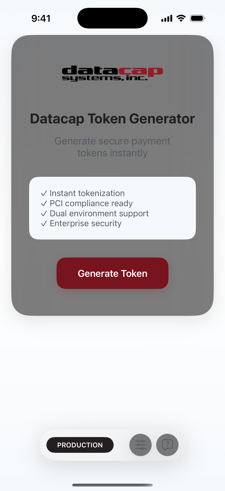
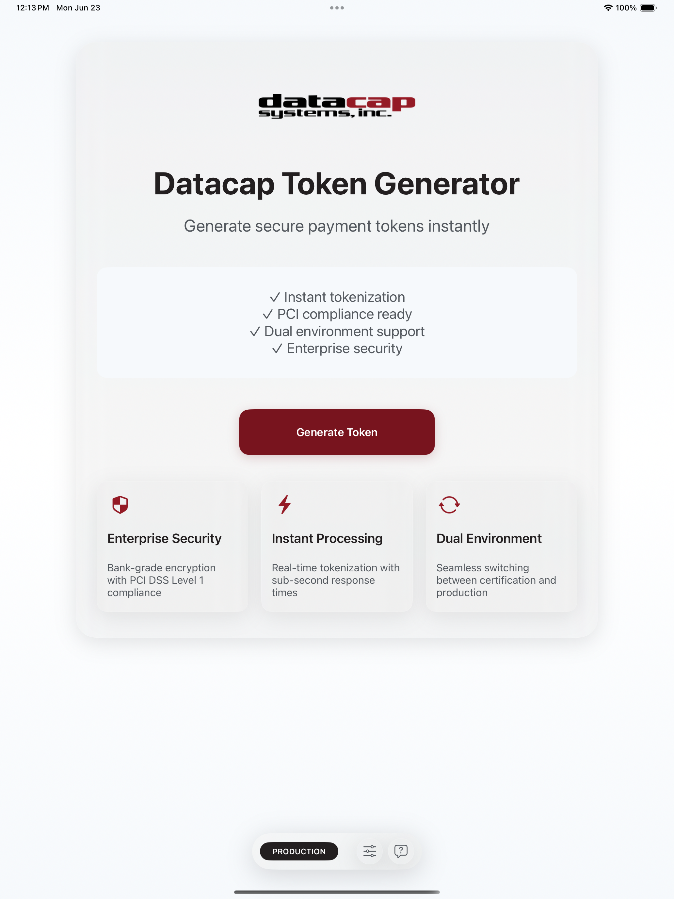
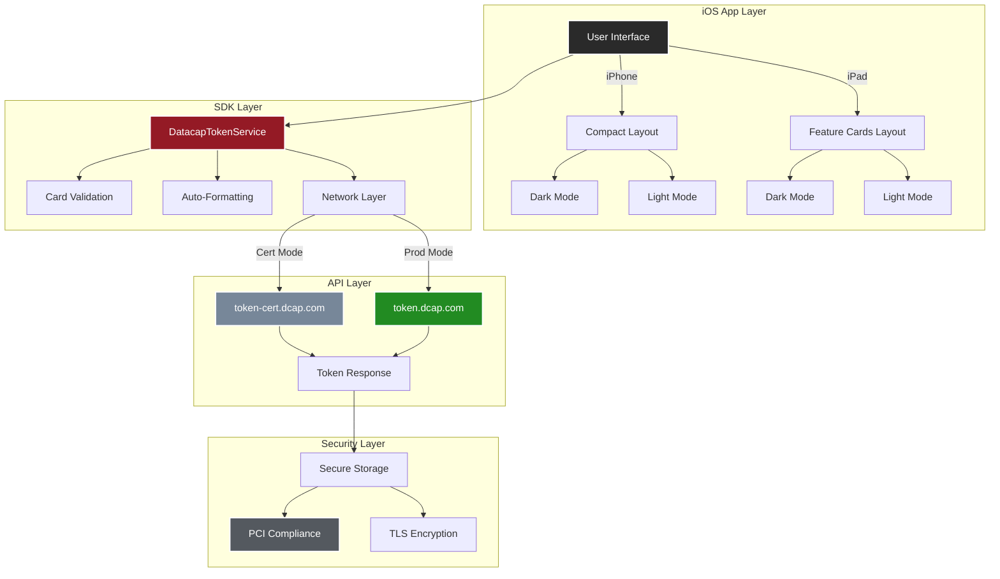
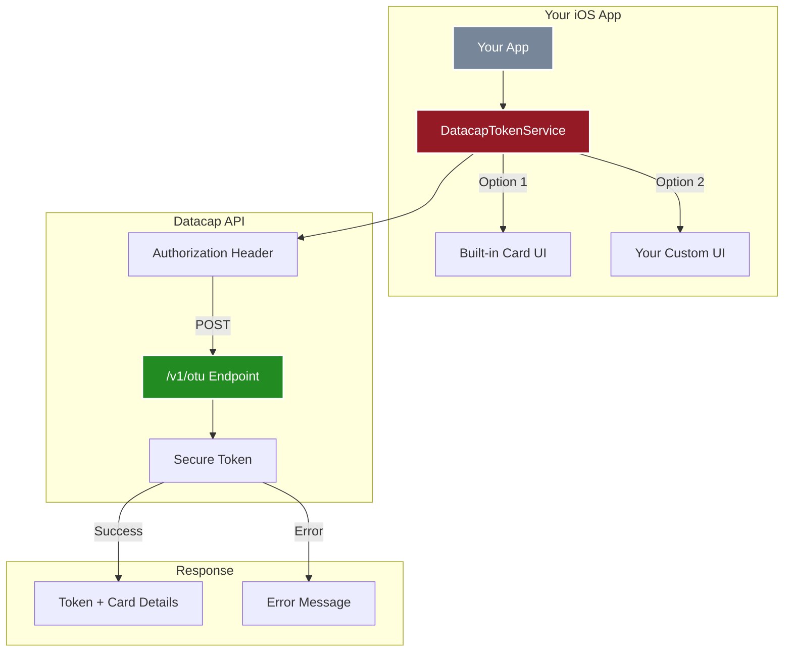
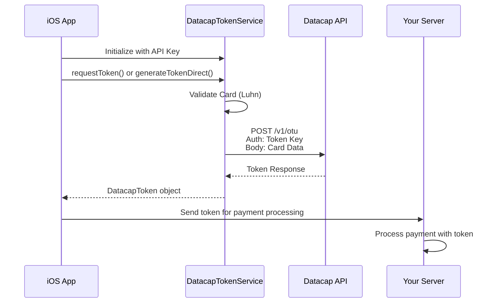
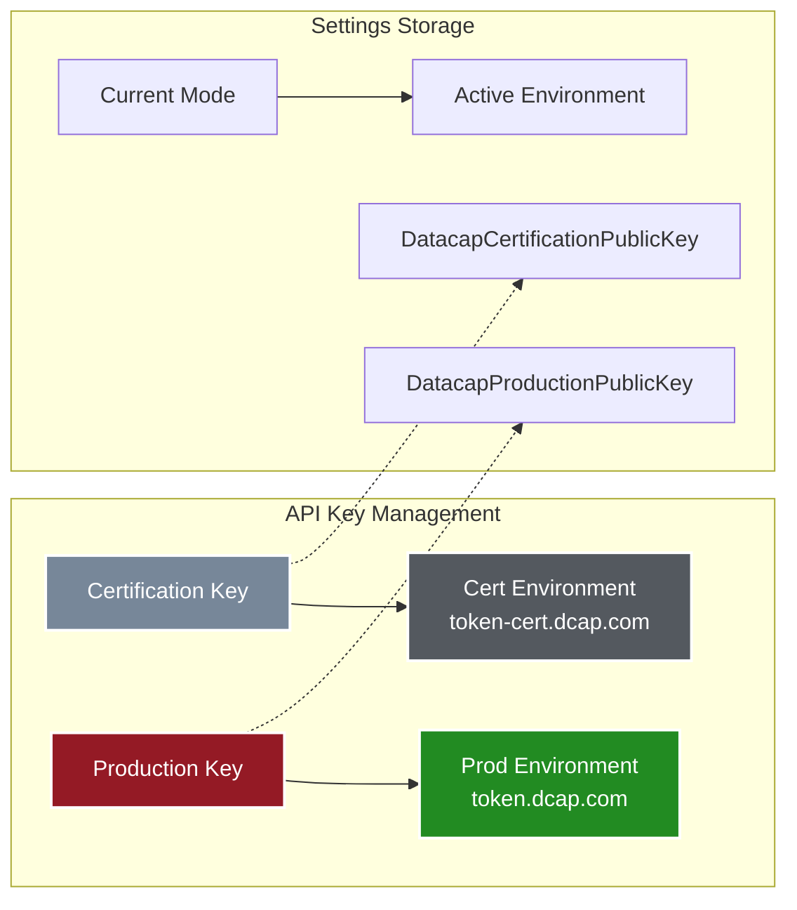
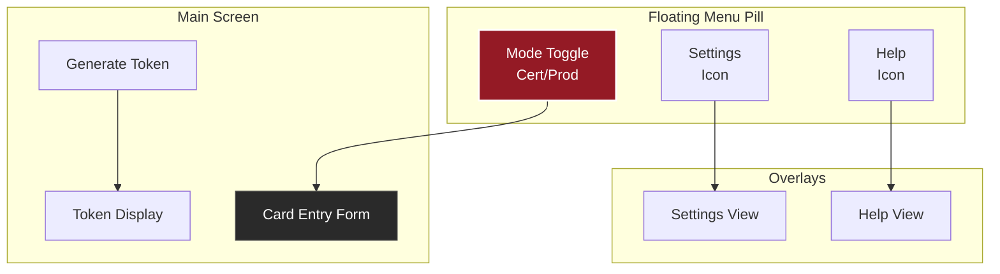
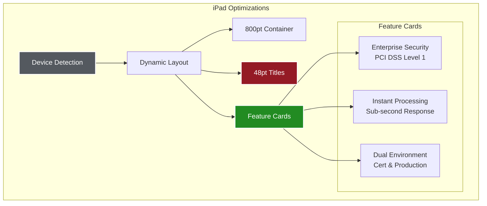
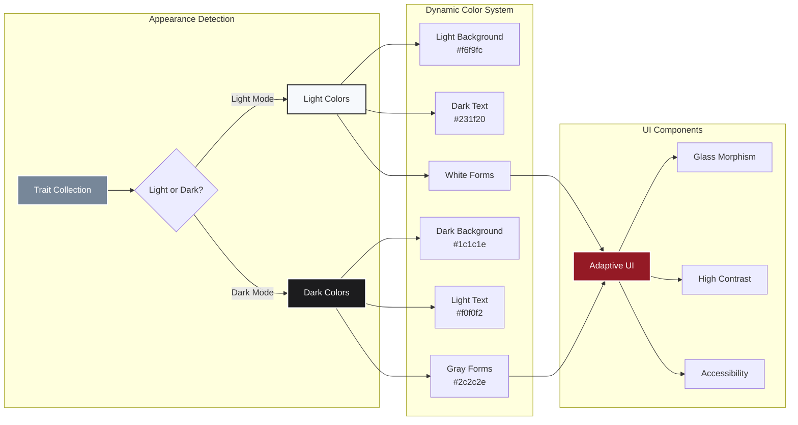

# Datacap Mobile Token for iOS

<div align="center">
  
  
  [](https://www.apple.com/ios/)
  [](https://swift.org/)
  [](https://developer.apple.com/xcode/)
  [](https://docs.datacapsystems.com)
  [](LICENSE)
</div>

## Overview

Enterprise payment tokenization for iOS. Strengthen PCI compliance with Datacap's cross-platform tokenization solution. This production-ready app and SDK enable merchants and ISVs to integrate secure payment tokenization with support for both certification and production environments.

### Key Benefits

- **Enterprise Security**: PCI compliance ready for production use
- **Processor Independence**: Switch payment processors without retokenization
- **P2PE Validated**: Point-to-point encryption certified solutions
- **Cross-Platform**: Use tokens across all sales channels
- **35+ Years of Innovation**: Datacap's proven payment technology

### Latest Updates (v1.3)

- **Glass Morphism Design**: Stunning iOS 26 liquid glass effects throughout
- **iPad Optimization**: Full-screen layout with feature cards and dynamic typography
- **Dark Mode Support**: Complete light/dark mode adaptation for all screens
- **Consistent UI**: Unified glass morphism across iPhone and iPad
- **Enhanced Typography**: Larger, clearer fonts for better readability
- **Dual Environment Support**: Separate API keys for certification and production
- **Floating Navigation**: Modern menu pill for quick access to settings and help
- **Professional Polish**: Enterprise-ready interface with attention to detail

## Screenshots

### iPhone Interface
<div align="center">
  
  
  
</div>

### iPad Interface
<div align="center">
  
  
</div>

### Dark Mode Support
<div align="center">
  
  
</div>

## Repository Structure

```
Datacap-MobileToken-iOS-2025/
├── DatacapTokenLibrary/        # Ready-to-use SDK for integrators
│   ├── Sources/                # DatacapTokenService.swift
│   └── README.md               # Quick integration guide
├── DatacapMobileTokenDemo/     # Reference implementation
│   ├── DatacapMobileDemo/      # Demo app with UI examples
│   └── *.xcodeproj             # Xcode project
├── INTEGRATION_GUIDE.md        # Detailed integration instructions
├── LICENSE                     # MIT License
└── CLAUDE.md                   # Developer reference guide
```

## Architecture

### Complete System Architecture



### SDK Architecture



### API Integration Flow



### Dual Environment Support



### iOS 26 UI Architecture



### iPad Layout Architecture



### Dark Mode Architecture



## Quick Start

### 1. Copy the SDK
```bash
cp DatacapTokenLibrary/Sources/DatacapTokenService.swift YourProject/
```

### 2. Initialize Service
```swift
import UIKit

class PaymentViewController: UIViewController {
    private var tokenService: DatacapTokenService!
    
    override func viewDidLoad() {
        super.viewDidLoad()
        
        tokenService = DatacapTokenService(
            publicKey: "YOUR_TOKEN_KEY",
            isCertification: true  // false for production
        )
        tokenService.delegate = self
    }
}
```

### 3. Generate Token
```swift
// Option 1: Use built-in UI
@IBAction func payButtonTapped() {
    tokenService.requestToken(from: self)
}

// Option 2: Use your own UI
let cardData = CardData(
    cardNumber: "4111111111111111",
    expirationMonth: "12",
    expirationYear: "25",
    cvv: "123"
)

Task {
    do {
        let token = try await tokenService.generateTokenDirect(for: cardData)
        // Process payment with token
    } catch {
        // Handle error
    }
}
```

### 4. Handle Response
```swift
extension PaymentViewController: DatacapTokenServiceDelegate {
    func tokenRequestDidSucceed(_ token: DatacapToken) {
        print("Token: \(token.token)")
        print("Card: \(token.maskedCardNumber)")
        print("Type: \(token.cardType)")
        // Send token to your server
    }
    
    func tokenRequestDidFail(error: DatacapTokenError) {
        // Handle error
    }
    
    func tokenRequestDidCancel() {
        // User cancelled
    }
}
```

## Key Features

### SDK Features
- **Real API Integration**: Direct REST API calls to Datacap's OTU endpoints
- **Dual Key Support**: Separate keys for certification and production
- **Two Integration Modes**: Built-in UI or bring your own
- **Card Validation**: Luhn algorithm, BIN detection, format validation
- **Zero Dependencies**: Pure Swift, no external libraries
- **Easy Integration**: Single file to add to your project

### App Features
- **Modern UI**: iOS 26 Liquid Glass design system
- **Settings Management**: Configure and test both environments
- **Smart Card Entry**: Auto-formatting, type detection
- **Native Date Picker**: Wheel-style expiration selection
- **Live Validation**: Real-time feedback as you type
- **Token Display**: Copy token with one tap
- **Dark Mode**: Full support for light and dark appearance
- **iPad Optimized**: Responsive layouts with feature cards
- **Accessibility**: High contrast and dynamic type support

## API Documentation

### Endpoints
- **Certification**: `https://token-cert.dcap.com/v1/otu`
- **Production**: `https://token.dcap.com/v1/otu`

### Request Format
```http
POST /v1/otu
Authorization: {your-token-key}
Content-Type: application/json

{
    "Account": "4111111111111111",
    "ExpirationMonth": "12",
    "ExpirationYear": "25",
    "CVV": "123"
}
```

### Response Format
```json
{
    "Token": "DC4:AAAMbdJpMn6wZYlx84etCekz...",
    "Brand": "Visa",
    "ExpirationMonth": "12",
    "ExpirationYear": "2025",
    "Last4": "1111",
    "Bin": "411111"
}
```

## Test Cards

Use these in certification mode:

| Card Type | Number | CVV | Exp |
|-----------|--------|-----|-----|
| Visa | 4111111111111111 | 123 | Any future date |
| Mastercard | 5555555555554444 | 123 | Any future date |
| Amex | 378282246310005 | 1234 | Any future date |
| Discover | 6011111111111117 | 123 | Any future date |
| Diners | 36700102000000 | 123 | Any future date |

## Security

- **PCI Compliant**: No card data storage, tokenization only
- **TLS Encryption**: All API calls use HTTPS
- **Input Validation**: Luhn algorithm, BIN validation
- **Secure Entry**: Masked CVV input
- **One-Time Tokens**: Tokens are single-use only

## Running the App

```bash
# Clone repository
git clone https://github.com/datacapsystems/Datacap-MobileToken-iOS-2025.git
cd Datacap-MobileToken-iOS-2025

# Open in Xcode
open DatacapMobileTokenDemo/DatacapMobileTokenDemo.xcodeproj

# Build and run (⌘+R)
```

### App Configuration
1. Launch app
2. Tap Settings (gear icon)
3. Select Certification mode
4. Enter your test API key
5. Save configuration
6. Tap "Generate Token"

## Requirements

- iOS 15.6+
- Xcode 16.0+
- Swift 5.0+
- Network connectivity

## Support

- **Documentation**: [docs.datacapsystems.com](https://docs.datacapsystems.com)
- **Developer Portal**: [dsidevportal.com](https://www.dsidevportal.com)
- **Support**: [datacapsystems.com/support](http://datacapsystems.com/support)
- **GitHub Issues**: [Report bugs here](https://github.com/datacapsystems/Datacap-MobileToken-iOS-2025/issues)

## License

This project is licensed under the MIT License - see the [LICENSE](LICENSE) file for details.

---

<div align="center">
  <b>Built with care by Datacap Systems</b><br>
  <i>Secure Payment Solutions Since 1983</i>
</div>