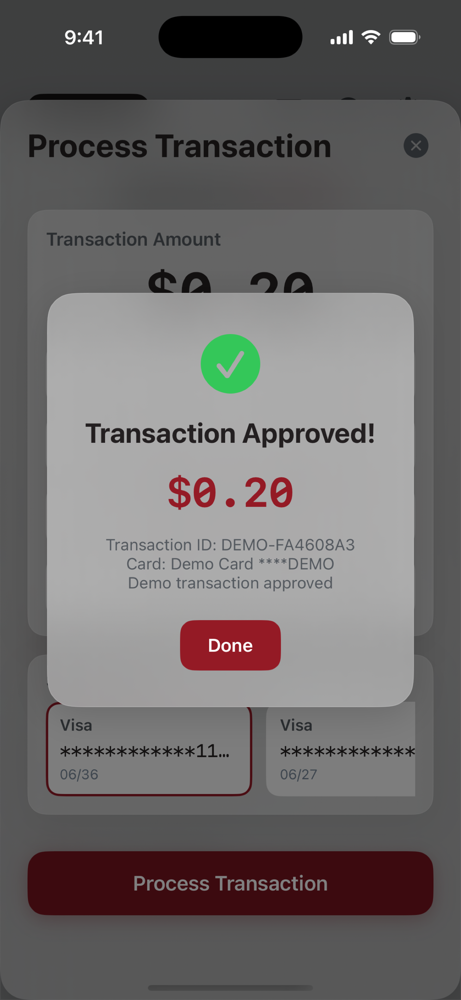
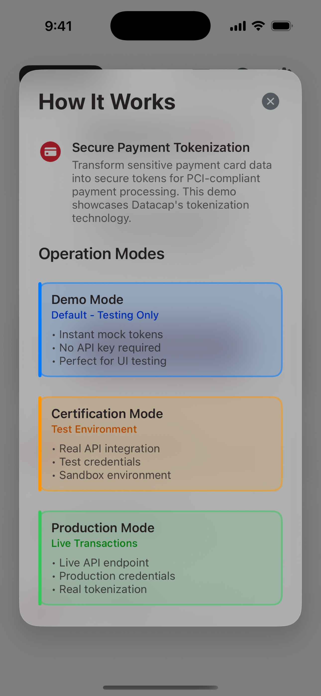
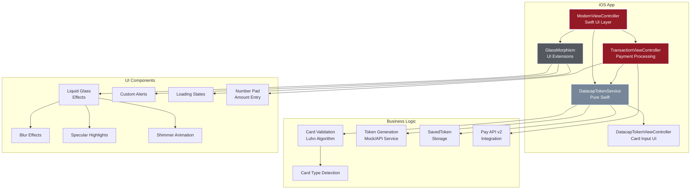
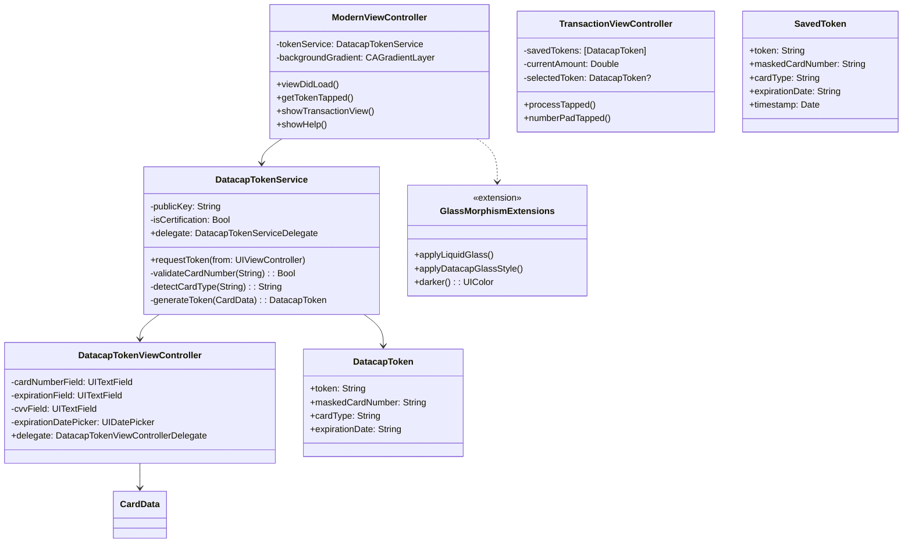
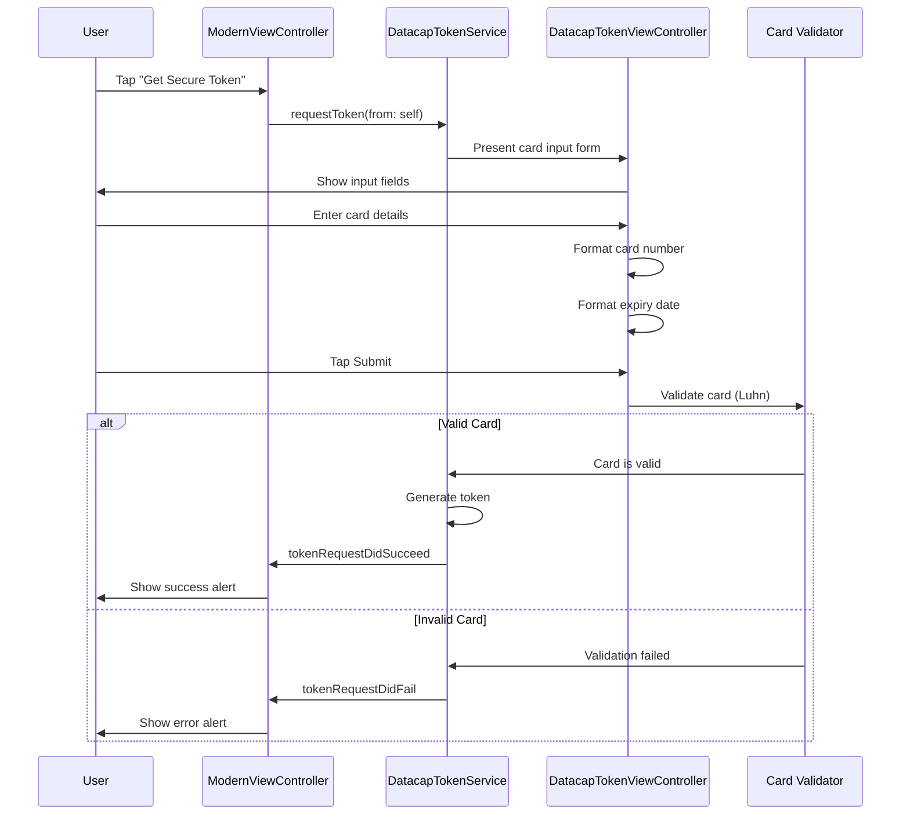

# Datacap MobileToken iOS Demo 2025 🚀

<div align="center">
  
  
  [](https://www.apple.com/ios/)
  [](https://swift.org/)
  [](https://developer.apple.com/xcode/)
  [](LICENSE)
  [](APP_STORE_SUBMISSION.md)
</div>

## 🚀 Overview

A modern iOS application demonstrating Datacap's payment gateway integration for brick-and-mortar merchants. This demo app showcases manual card entry as used at physical point-of-sale locations, featuring iOS 26 Liquid Glass design system. Perfect for demonstrating how physical retailers can securely process card-present transactions through our third-party payment gateway.

## 🎨 Features

### Core Functionality
- **Secure Payment Tokenization**: Convert credit/debit card numbers into secure tokens
- **Real-time Card Type Detection**: Automatically identifies Visa, Mastercard, Amex, Discover, and more
- **Smart Input Formatting**: Dynamic card number formatting based on card type
- **Three Operation Modes**: Demo, Certification, and Production environments
- **Token Saving**: Automatically saves generated tokens for one-click reuse
- **Transaction Processing**: Process payments using saved tokens with Pay API v2
- **Configurable Amounts**: Built-in number pad for entering USD transaction amounts
- **API Configuration**: Built-in settings for API key and endpoint management
- **In-App Help**: Comprehensive help overlay with improved readability and contrast

### UI/UX Excellence
- **iOS 26 Liquid Glass Design**: Modern glass morphism with blur effects and specular highlights
- **Date Picker for Expiry**: Native iOS date selector wheel for card expiration
- **Smooth Animations**: Spring animations and haptic feedback
- **Responsive Layout**: Adapts to all iPhone and iPad sizes
- **Custom Alerts**: Beautiful success/error notifications with glass morphism
- **Dynamic Button States**: Visual feedback with scale animations
- **Enhanced Readability**: Improved help overlay with 0.15 opacity and thicker borders
- **Consistent Button Styling**: Bold red CTA buttons with matching typography
- **Token Card Display**: Expanded width (180px) prevents text cutoff
- **Professional Polish**: "CERTIFICATION MODE" label for clarity

### Security Features
- **No Sensitive Data Storage**: Card details are never persisted
- **Secure API Communication**: HTTPS-only connections
- **Input Validation**: Luhn algorithm and format verification
- **PCI Compliance**: Follows industry security standards
- **Demo/Production Isolation**: Clear visual indicators for mode

## 📱 Screenshots

<div align="center">
  <table>
    <tr>
      <td align="center">
        
        <br><b>Home Screen</b>
      </td>
      <td align="center">
        
        <br><b>Token Generation</b>
      </td>
      <td align="center">
        
        <br><b>Transaction Processing</b>
      </td>
    </tr>
    <tr>
      <td align="center">
        
        <br><b>API Configuration</b>
      </td>
      <td align="center">
        
        <br><b>In-App Help</b>
      </td>
      <td align="center">
        
        <br><b>Token Success</b>
      </td>
    </tr>
  </table>
</div>

## 🏗️ Architecture

### High-Level Architecture



### Component Architecture



### Tokenization Flow



## 🛠️ Technical Stack

- **Language**: Swift 5.0+ & Objective-C
- **UI Framework**: UIKit with programmatic UI
- **Design Pattern**: MVC with Extensions
- **Minimum iOS**: 15.6
- **Architecture**: arm64, x86_64 (Simulator)

## 🎨 Asset Generation

### App Store Assets
Generate all required assets using included scripts:

```bash
# Generate app icons (all sizes)
./create-app-icon.swift

# Generate App Store asset structure
./generate-app-store-assets.sh

# Capture screenshots interactively
./capture-screenshots-interactive.sh

# Resize screenshots for App Store
./resize-screenshots.sh
```

**Generated Files:**
- `AppIcons/` - All app icon sizes with Contents.json
- `AppStoreAssets/Screenshots/Resized_AppStore/` - Properly sized screenshots (1290×2796px)
- `APP_STORE_ASSETS_SUMMARY.md` - Complete asset checklist

## 📦 Installation

### Prerequisites

- Xcode 15.0 or later
- iOS 15.6+ deployment target
- Apple Developer account (for device testing)

### Setup

1. **Clone the repository**
   ```bash
   git clone git@github.com:datacapsystems/Datacap-MobileToken-iOS-2025.git
   cd Datacap-MobileToken-iOS-2025
   ```

2. **Open in Xcode**
   ```bash
   open DatacapMobileTokenDemo/DatacapMobileTokenDemo.xcodeproj
   ```

3. **Configure signing**
   - Select the project in Xcode
   - Go to "Signing & Capabilities"
   - Select your team
   - Update bundle identifier if needed

4. **Build and run**
   - Select a simulator or device
   - Press ⌘+R to build and run

## 🚀 Quick Start

### Using the Build Script

For a streamlined build process, use our automated script:

```bash
./build-and-install.sh
```

This interactive script will:
- List available simulators
- Build the project
- Install on selected simulator
- Launch the app automatically

### Deploy to Physical iPhone

To install on your connected iPhone:

```bash
./deploy-to-phone.sh
```

This will guide you through:
- Setting up code signing
- Selecting your device
- Building and installing the app
- Trusting developer certificate

### Manual Build

```bash
xcodebuild -project DatacapMobileTokenDemo/DatacapMobileTokenDemo.xcodeproj \
  -scheme DatacapMobileTokenDemo \
  -destination 'platform=iOS Simulator,name=iPhone 16 Pro' \
  build
```

### Troubleshooting Installation

If you're having issues installing:

```bash
./diagnose-install.sh
```

## 💳 Testing

### Test Card Numbers

| Card Type | Number | CVV | Max Length | Formatting |
| Visa | 4111111111111111 | 123 | 16 | 4-4-4-4 |
| Mastercard | 5555555555554444 | 123 | 16 | 4-4-4-4 |
| Amex | 378282246310005 | 1234 | 15 | 4-6-5 |
| Discover | 6011111111111117 | 123 | 16 | 4-4-4-4 |
| Diners Club | 36700102000000 | 123 | 14 | 4-6-4 |

### Card Detection Logic

The app automatically detects card types based on BIN (Bank Identification Number):

- **Visa**: Starts with 4
- **Mastercard**: Starts with 51-55 or 2221-2720
- **Amex**: Starts with 34 or 37
- **Discover**: Starts with 6011, 65, or 644-649
- **Diners Club**: Starts with 36, 38, or 300-305

## 🔧 Project Structure

```
DatacapMobileTokenDemo/
├── DatacapMobileDemo/
│   ├── ModernViewController.swift      # Main UI controller
│   ├── DatacapTokenService.swift       # Token service logic
│   ├── GlassMorphismExtensions.swift   # UI extensions
│   ├── AppDelegate.m/h                 # App lifecycle
│   ├── ViewController.m/h              # Legacy support
│   └── Assets.xcassets/                # Images and colors
├── DatacapMobileToken.xcframework/     # Legacy framework (unused)
└── DatacapMobileTokenDemo.xcodeproj/   # Xcode project
```

## 🎯 Key Components

### DatacapTokenService
Pure Swift implementation providing:
- Card number validation (Luhn algorithm)
- Card type detection (Visa, MC, Amex, etc.)
- Mock token generation
- Delegate pattern for async callbacks

### ModernViewController
Main UI featuring:
- iOS 26 Liquid Glass design
- Animated gradient backgrounds
- Glass morphism effects
- Custom success/error alerts

### GlassMorphismExtensions
Reusable UI components:
- `applyLiquidGlass()` - Glass morphism effects
- `applyDatacapGlassStyle()` - Branded buttons
- `LiquidGlassLoadingView` - Loading animations

## 🔐 Security

- No sensitive data logging
- Secure text entry for CVV
- Card numbers masked in display
- Demo mode with test keys
- PCI compliance ready

## 📱 App Store Submission

**Status**: 🎉 **Submitted for Review!**

### Submission Progress
- ✅ Bundle ID: `dsi.dcap.demo`
- ✅ All assets generated and properly sized
- ✅ App Store Connect listing completed
- ✅ Archive built and uploaded successfully
- ✅ Build 1.1 selected and approved
- ✅ Screenshots uploaded (iPhone & iPad)
- ✅ App icon uploaded (1024x1024)
- ✅ Categories set (Finance / Developer Tools)
- ✅ Age rating: 4+
- ✅ Privacy policy configured
- ✅ Submitted for App Store review

### Generated Assets
- **App Icons**: All 19 sizes (20x20 to 1024x1024) in `AppIcons/`
- **iPhone Screenshots**: 6.7" display (1290×2796px) in `AppStoreAssets/Screenshots/Resized_AppStore/`
- **iPad Screenshots**: 13" display (2048×2732px) in `~/Desktop/iPad_Screenshots/`
- **Marketing Text**: Condensed to ~2400 characters in [APP_STORE_LISTING.md](APP_STORE_LISTING.md)

### Quick Submission Guide
1. **App Name**: Datacap Token
2. **Bundle ID**: `dsi.dcap.demo` (using existing App ID)
3. **SKU**: DATACAP-TOKEN-2025
4. **Primary Category**: Finance
5. **Secondary Category**: Developer Tools
6. **Screenshots**: Upload from `AppStoreAssets/Screenshots/Resized_AppStore/` in order:
   - 1_Home_67.png
   - 2_Token_67.png
   - 3_Transaction_67.png
   - 4_Settings_67.png
   - 5_Help_67.png

### Build for App Store
```bash
# As regular user (not root!)
./quick-app-store-build.sh

# Or use Xcode GUI:
open DatacapMobileTokenDemo/DatacapMobileTokenDemo.xcodeproj
# Product → Archive → Distribute App
```

See [APP_STORE_SUBMISSION.md](APP_STORE_SUBMISSION.md) for detailed guidelines.

## 🐛 Troubleshooting

See [TROUBLESHOOTING.md](TROUBLESHOOTING.md) for common issues and solutions.

### Common Issues

1. **MinimumOSVersion Error**: Update Info.plist to match your device iOS version
2. **Code Signing**: Enable automatic signing in Xcode
3. **ThreatLocker Blocking**: Add exception for Xcode and the app
4. **Device Not Found**: Reconnect USB and trust computer on device

## 📚 Documentation

- [CLAUDE.md](CLAUDE.md) - AI assistant guide
- [APP_STORE_SUBMISSION.md](APP_STORE_SUBMISSION.md) - Submission checklist
- [TROUBLESHOOTING.md](TROUBLESHOOTING.md) - Common issues

## 🤝 Support

For technical support and questions:
- Email: support@datacapsystems.com
- Documentation: https://docs.datacapsystems.com
- Issues: https://github.com/datacapsystems/Datacap-MobileToken-iOS-2025/issues

## 📄 License

This project is proprietary software. See LICENSE file for details.

---

<div align="center">
  <p>Built with ❤️ by <a href="https://datacapsystems.com">Datacap Systems</a></p>
  <p>© 2025 Datacap Systems, Inc. All rights reserved.</p>
</div>