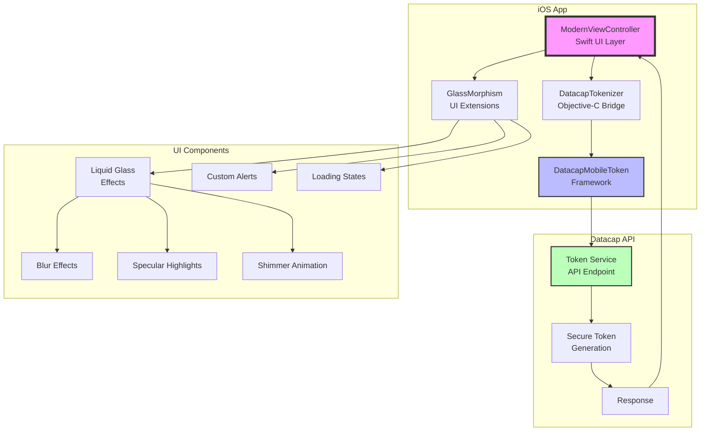

# Datacap Token iOS - Modern Payment Tokenization

<div align="center">
  
  
  [](https://www.apple.com/ios/)
  [](https://swift.org/)
  [](LICENSE)
  [](APP_STORE_SUBMISSION.md)
</div>

## 🚀 Overview

Datacap Token is a cutting-edge iOS application that demonstrates secure payment tokenization using Datacap's MobileToken SDK. Built with iOS 26's stunning Liquid Glass design language, this app provides enterprise-grade security with a beautiful, modern interface.

## 🎨 Features

- **iOS 26 Liquid Glass UI** - Stunning glass morphism effects with dynamic animations
- **Secure Tokenization** - Convert sensitive payment data to secure tokens
- **Bank-Level Encryption** - Industry-standard security protocols
- **Lightning Fast** - Get tokens in milliseconds
- **PCI Compliant** - Meet all regulatory requirements
- **Beautiful Animations** - Smooth transitions and haptic feedback

## 📱 Screenshots

<div align="center">
  
  
  
</div>

## 🏗️ Architecture



## 🛠️ Technical Stack

- **Language**: Swift 5.0+ & Objective-C
- **UI Framework**: UIKit with programmatic UI
- **Design Pattern**: MVC with Extensions
- **Minimum iOS**: 13.0
- **Architecture**: arm64, armv7

## 📦 Getting Started with MobileToken for iOS

### Add DatacapMobileToken.xcframework to your Xcode project
1. In the project navigator, select the project or group within a project to which you want to add the framework.
2. Choose File > Add Files to "*Your Project Name*".
3. Select the DatacapMobileToken.xcframework bundle, and click Add.
4. In the project settings, choose the Build Phases tab.
5. Under the Embed Frameworks section, choose "+" to add a new Embedded Framework.
6. Select the DatacapMobileToken.xcframework bundle, and click Add.

### Installation

#### Prerequisites

- Xcode 15.0 or later
- iOS 13.0+ deployment target
- Apple Developer account (for device testing)

#### Setup

1. **Clone the repository**
   ```bash
   git clone git@github.com:datacapsystems/Datacap-MobileToken-iOS-2025.git
   cd Datacap-MobileToken-iOS-2025
   ```

2. **Open in Xcode**
   ```bash
   open DatacapMobileTokenDemo/DatacapMobileTokenDemo.xcodeproj
   ```

## 🚀 Building and Testing

### Building for iOS Simulator

1. **Open the Project**
   ```bash
   cd /path/to/Datacap-MobileToken-iOS-2025
   open DatacapMobileTokenDemo/DatacapMobileTokenDemo.xcodeproj
   ```

2. **Configure Build Settings**
   - Select the project in navigator
   - Go to Build Settings tab
   - Search for "Objective-C Bridging Header"
   - Set to: `DatacapMobileDemo/DatacapMobileDemo-Bridging-Header.h`

3. **Select Simulator**
   - Click device selector in Xcode toolbar
   - Choose iPhone 14 Pro or newer (recommended)
   - Download simulator if needed via Window → Devices and Simulators

4. **Build and Run**
   - Press `⌘+R` or click Play button
   - App will launch with glass morphism UI

### Building for Your iPhone

1. **Prerequisites**
   - Connect iPhone via USB cable
   - Trust computer when prompted on phone
   - Enable Developer Mode (iOS 16+):
     - Settings → Privacy & Security → Developer Mode → Enable
     - Restart phone when prompted

2. **Configure Code Signing**
   - Go to Signing & Capabilities tab
   - Check "Automatically manage signing"
   - Select Team (use personal Apple ID if no paid developer account)
   - Bundle Identifier: `com.datacapsystems.mobiletoken` (or change to your own)

3. **Select Your Device**
   - Choose your iPhone from device selector
   - Wait for Xcode to prepare device (first time only)

4. **Install and Run**
   - Press `⌘+R` to build and install
   - If prompted about untrusted developer:
     - On iPhone: Settings → General → VPN & Device Management
     - Trust your developer certificate

### Command Line Build (Automated)

For automated builds without Xcode UI:

```bash
# Build for simulator
xcodebuild -project DatacapMobileTokenDemo/DatacapMobileTokenDemo.xcodeproj \
  -scheme DatacapMobileTokenDemo \
  -destination 'platform=iOS Simulator,name=iPhone 14 Pro' \
  build

# Build for device (requires provisioning)
xcodebuild -project DatacapMobileTokenDemo/DatacapMobileTokenDemo.xcodeproj \
  -scheme DatacapMobileTokenDemo \
  -destination 'platform=iOS,name=Your iPhone Name' \
  build
```

### Using Fastlane (Advanced)

Create a `Fastfile` for automated deployment:

```ruby
# fastlane/Fastfile
platform :ios do
  desc "Build and install on device"
  lane :install do
    build_app(
      project: "DatacapMobileTokenDemo/DatacapMobileTokenDemo.xcodeproj",
      scheme: "DatacapMobileTokenDemo",
      export_method: "development"
    )
    install_on_device
  end
end
```

Then run: `fastlane install`

### Testing the App

1. **Launch App** - See glass morphism home screen
2. **Tap "Get Secure Token"** - Opens tokenization form
3. **Enter Test Card Data**:
   - Number: `4111111111111111` (Visa)
   - Expiry: Any future date (e.g., 12/25)
   - CVV: Any 3 digits (e.g., 123)
4. **Submit** - Receive secure token response

### Troubleshooting

#### Common Issues

**"Module 'DatacapMobileToken' not found"**
- Clean build: `⌘+Shift+K`
- Delete derived data: `rm -rf ~/Library/Developer/Xcode/DerivedData`
- Ensure framework is set to "Embed & Sign"

**"Could not launch app - code signing"**
- Check team selection in Signing & Capabilities
- For free accounts, delete app from device every 7 days
- Verify provisioning profile is valid

**"Unable to install app"**
- Delete existing app from device
- Restart Xcode and device
- Check device has enough storage

**Build succeeds but app crashes**
- Check console for errors: `⌘+Shift+Y`
- Verify deployment target is iOS 13.0+
- Ensure all frameworks are properly embedded

#### Xcode Terms Agreement Issue

If Xcode shows "You must agree to terms":
1. Quit Xcode completely
2. Open Terminal and run: `sudo xcodebuild -license accept`
3. Or reboot Mac and reopen Xcode
4. Click through agreement prompts

### Quick Commands Reference

| Action | Shortcut |
|--------|----------|
| Build | `⌘+B` |
| Run | `⌘+R` |
| Stop | `⌘+.` |
| Clean | `⌘+Shift+K` |
| Console | `⌘+Shift+Y` |
| Devices | `⌘+Shift+2` |

## 🔧 Configuration

### Include the framework in your code
```objective-c
#import <DatacapMobileToken/DatacapMobileToken.h>
```

### Swift Bridging Header

For Swift projects, use a bridging header:
```objc
// DatacapMobileDemo-Bridging-Header.h
#import <DatacapMobileToken/DatacapMobileToken.h>
#import "ViewController.h"
```

### Implement the tokenization delegate

#### Implement the `DatacapTokenDelegate` protocol
```objective-c
@interface ViewController : UIViewController <DatacapTokenDelegate>
```

Or in Swift:
```swift
class ModernViewController: UIViewController, DatacapTokenDelegate {
```

#### Implement `DatacapTokenDelegate` methods

**On Loading:**
```objective-c
- (void)tokenLoading
{
  // The framework has begun tokenizing user-input account data.
}
```

**On Success:**
```objective-c
- (void)tokenCreated:(DatacapToken *)token
{
  // A token has been received!
}
```

In the `tokenCreated` method, the received `DatacapToken` object contains 5 `NSString` properties:  
* `Token`: The one-time-use token for the user-entered account data.
* `Brand`: The card brand of account represented by the token.
* `ExpirationMonth`: The 2-digit expiration month of the account.
* `ExpirationYear`: The 4-digit expiration year of the account.
* `Last4`: The last 4 digits of the account number.

**On Error:**
```objective-c
- (void)tokenizationError:(NSError *)error
{
  // A tokenization error has occurred!
}
```

The `tokenizationError` method will receive an `NSError` object with one of the 4 following error codes:
* `DMTConnectionError`: Failed to communicate with Datacap Token API.
* `DMTAuthenticationError`: Public key authentication failed.
* `DMTDataValidationError`: Failed to tokenize due to invalid account information.
* `DMTTokenizationError`: An error has occurred tokenizing the account data at the Datacap Token API.

**On Cancel:**
```objective-c
- (void)tokenizationCancelled
{
  // The user has cancelled tokenization!
}
```

### Request a token for keyed account

Provide a `DatacapTokenizer` object with a Datacap public key, a `DatacapTokenDelegate` object which to send events, and a `UIViewController` over which to display the account entry views:

```objective-c
DatacapTokenizer *tokenizer = [DatacapTokenizer new];
[tokenizer requestKeyedTokenWithPublicKey:@"[Public Key Goes Here]"
			  isCertification:true // <-- remove for production
                              andDelegate:self
                       overViewController:self];
```

Or in Swift:
```swift
let tokenizer = DatacapTokenizer()
tokenizer.requestKeyedToken(
    withPublicKey: "YOUR_PRODUCTION_PUBLIC_KEY",
    isCertification: false,  // Set to false for production
    andDelegate: self,
    overViewController: self
)
```

## 🎯 Advanced Usage

### Custom UI Styling

The demo app includes modern glass morphism extensions:

```swift
// Apply glass morphism to any view
myView.applyLiquidGlass(
    intensity: 0.85,
    cornerRadius: 20,
    shadowOpacity: 0.15
)

// Add shimmer effect
myView.addGlassShimmer()

// Style buttons with Datacap branding
myButton.applyDatacapGlassStyle(isPrimary: true)
```

## 🎨 Design System

### Colors

| Color | Hex | Usage |
|-------|-----|-------|
| Primary Red | #941a25 | Buttons, accents |
| Dark Gray | #54595f | Text, secondary |
| Blue Gray | #778799 | Subtle elements |
| Near Black | #231f20 | Headers |
| Light Background | #f6f9fc | Backgrounds |

### Glass Morphism Parameters

- **Blur Intensity**: 0.85 - 0.95
- **Corner Radius**: 16 - 24px
- **Shadow Opacity**: 0.05 - 0.20
- **Border Width**: 0.5px
- **Border Opacity**: 0.2

## 📱 App Store Submission

See [APP_STORE_SUBMISSION.md](APP_STORE_SUBMISSION.md) for complete submission guidelines.

### Quick Checklist

- [ ] Update version and build number
- [ ] Test on multiple devices
- [ ] Create App Store screenshots
- [ ] Prepare app description and keywords
- [ ] Archive and validate
- [ ] Submit for review

## 🧪 Testing

### Manual Testing

1. Launch app and verify glass morphism effects
2. Tap "Get Secure Token" button
3. Enter test card data
4. Verify token generation
5. Check error handling

### Test Card Numbers

Use these test cards in certification mode:
- Visa: 4111111111111111
- Mastercard: 5555555555554444
- Amex: 378282246310005

## 🔒 Security

- All payment data is transmitted over secure HTTPS
- No sensitive data is stored on device
- Tokens are one-time use only
- PCI DSS compliant implementation

## 🤝 Contributing

1. Fork the repository
2. Create your feature branch (`git checkout -b feature/AmazingFeature`)
3. Commit your changes (`git commit -m 'Add some AmazingFeature'`)
4. Push to the branch (`git push origin feature/AmazingFeature`)
5. Open a Pull Request

## 📄 License

This project is proprietary software owned by Datacap Systems, Inc. All rights reserved.

## 🆘 Support

- **Technical Support**: https://datacapsystems.com/support
- **Documentation**: https://docs.datacapsystems.com
- **Issues**: https://github.com/datacapsystems/Datacap-MobileToken-iOS-2025/issues

## 🙏 Acknowledgments

- Built with Datacap's MobileToken SDK
- Inspired by iOS 26's Liquid Glass design
- Optimized for modern iOS devices

### Report bugs
If you encounter any bugs or issues with the latest version of MobileToken for iOS, please report them to us by opening a [GitHub Issue](https://github.com/datacapsystems/Datacap-MobileToken-iOS-2025/issues)!

---

<div align="center">
  Made with ❤️ by <a href="https://datacapsystems.com">Datacap Systems</a>
</div>