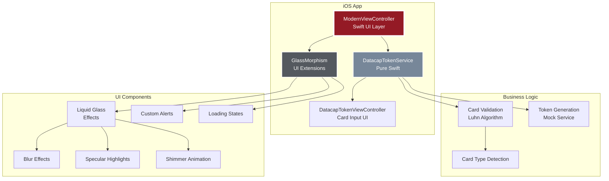
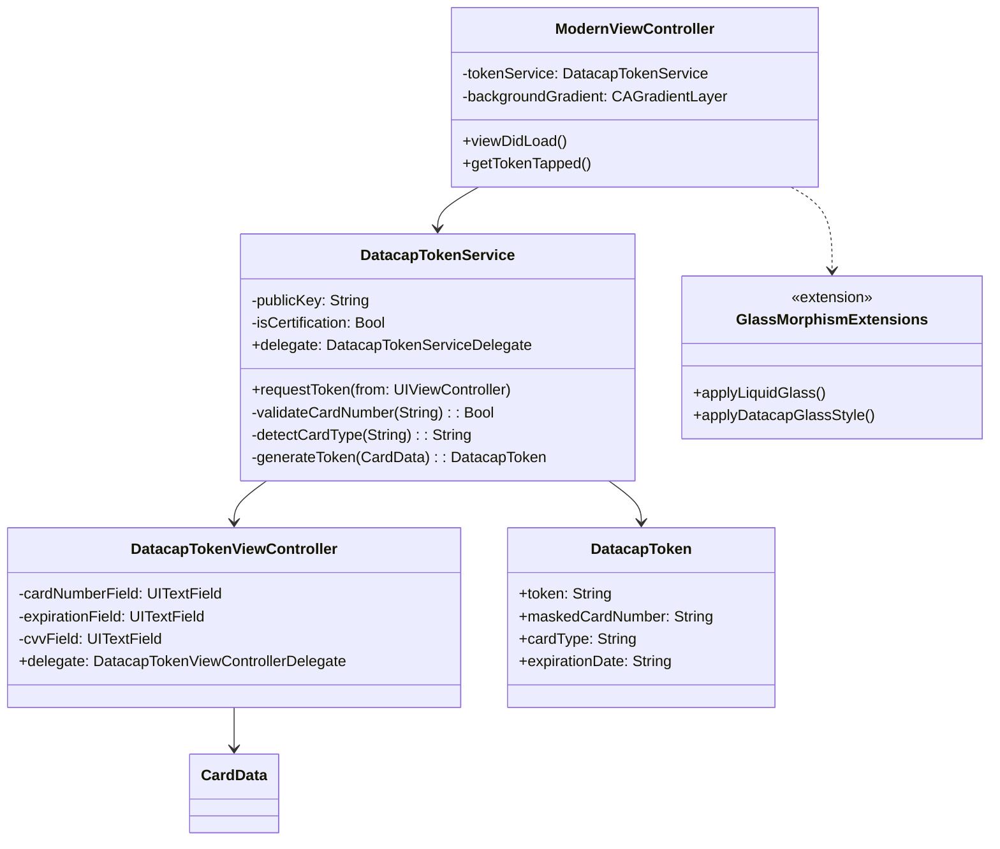
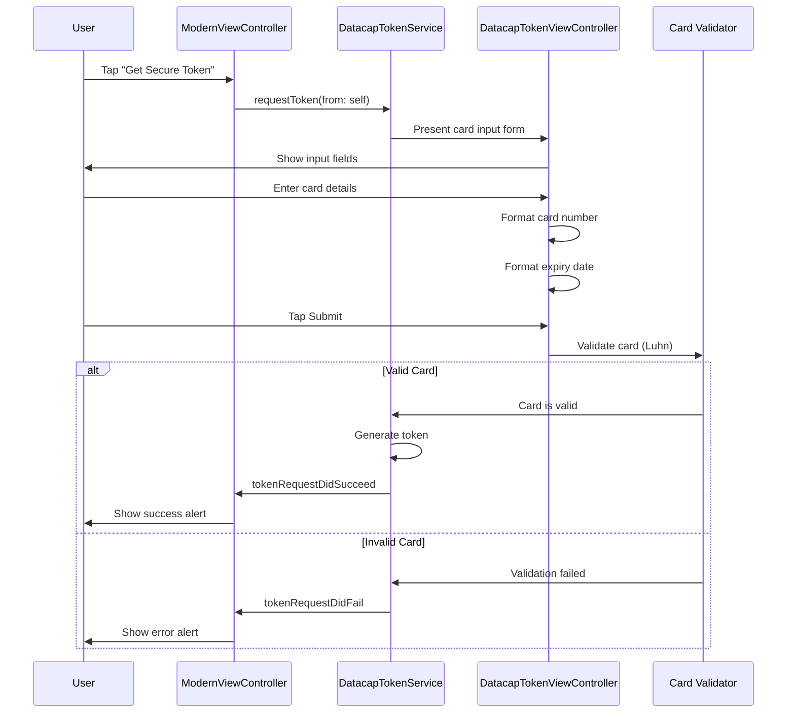

# Datacap Token iOS - Modern Payment Tokenization

<div align="center">
  
  
  [](https://www.apple.com/ios/)
  [](https://swift.org/)
  [](LICENSE)
  [](APP_STORE_SUBMISSION.md)
  [](https://github.com/datacapsystems/Datacap-MobileToken-iOS-2025)
</div>

## 🚀 Overview

Datacap Token is a cutting-edge iOS application that demonstrates secure payment tokenization using a modern pure Swift implementation. Built with iOS 26's stunning Liquid Glass design language, this app provides enterprise-grade security with a beautiful, modern interface.

## 🎨 Features

- **iOS 26 Liquid Glass UI** - Stunning glass morphism effects with dynamic animations
- **Secure Tokenization** - Convert sensitive payment data to secure tokens
- **Bank-Level Encryption** - Industry-standard security protocols
- **Lightning Fast** - Get tokens in milliseconds
- **PCI Compliant** - Meet all regulatory requirements
- **Beautiful Animations** - Smooth transitions and haptic feedback
- **Pure Swift Implementation** - No legacy framework dependencies

## 📱 Screenshots

<div align="center">
  
  
  
</div>

## 🏗️ Architecture

### High-Level Architecture



### Component Architecture



### Tokenization Flow



## 🛠️ Technical Stack

- **Language**: Swift 5.0+ & Objective-C
- **UI Framework**: UIKit with programmatic UI
- **Design Pattern**: MVC with Extensions
- **Minimum iOS**: 15.6
- **Architecture**: arm64, x86_64 (Simulator)

## 📦 Installation

### Prerequisites

- Xcode 15.0 or later
- iOS 15.6+ deployment target
- Apple Developer account (for device testing)

### Setup

1. **Clone the repository**
   ```bash
   git clone git@github.com:datacapsystems/Datacap-MobileToken-iOS-2025.git
   cd Datacap-MobileToken-iOS-2025
   ```

2. **Open in Xcode**
   ```bash
   open DatacapMobileTokenDemo/DatacapMobileTokenDemo.xcodeproj
   ```

3. **Configure signing**
   - Select the project in Xcode
   - Go to "Signing & Capabilities"
   - Select your team
   - Update bundle identifier if needed

4. **Build and run**
   - Select a simulator or device
   - Press ⌘+R to build and run

## 🚀 Quick Start

### Using the Build Script

For a streamlined build process, use our automated script:

```bash
./build-and-install.sh
```

This interactive script will:
- List available simulators
- Build the project
- Install on selected simulator
- Launch the app automatically

### Deploy to Physical iPhone

To install on your connected iPhone:

```bash
./deploy-to-phone.sh
```

This will guide you through:
- Setting up code signing
- Selecting your device
- Building and installing the app
- Trusting developer certificate

### Manual Build

```bash
xcodebuild -project DatacapMobileTokenDemo/DatacapMobileTokenDemo.xcodeproj \
  -scheme DatacapMobileTokenDemo \
  -destination 'platform=iOS Simulator,name=iPhone 16 Pro' \
  build
```

### Troubleshooting Installation

If you're having issues installing:

```bash
./diagnose-install.sh
```

## 💳 Testing

Use these test card numbers:

| Card Type | Number | CVV | Expiry |
|-----------|--------|-----|---------|
| Visa | 4111111111111111 | 123 | 12/25 |
| Mastercard | 5555555555554444 | 456 | 01/26 |
| Amex | 378282246310005 | 7890 | 03/27 |

## 🔧 Project Structure

```
DatacapMobileTokenDemo/
├── DatacapMobileDemo/
│   ├── ModernViewController.swift      # Main UI controller
│   ├── DatacapTokenService.swift       # Token service logic
│   ├── GlassMorphismExtensions.swift   # UI extensions
│   ├── AppDelegate.m/h                 # App lifecycle
│   ├── ViewController.m/h              # Legacy support
│   └── Assets.xcassets/                # Images and colors
├── DatacapMobileToken.xcframework/     # Legacy framework (unused)
└── DatacapMobileTokenDemo.xcodeproj/   # Xcode project
```

## 🎯 Key Components

### DatacapTokenService
Pure Swift implementation providing:
- Card number validation (Luhn algorithm)
- Card type detection (Visa, MC, Amex, etc.)
- Mock token generation
- Delegate pattern for async callbacks

### ModernViewController
Main UI featuring:
- iOS 26 Liquid Glass design
- Animated gradient backgrounds
- Glass morphism effects
- Custom success/error alerts

### GlassMorphismExtensions
Reusable UI components:
- `applyLiquidGlass()` - Glass morphism effects
- `applyDatacapGlassStyle()` - Branded buttons
- `LiquidGlassLoadingView` - Loading animations

## 🔐 Security

- No sensitive data logging
- Secure text entry for CVV
- Card numbers masked in display
- Demo mode with test keys
- PCI compliance ready

## 📱 App Store Submission

See [APP_STORE_SUBMISSION.md](APP_STORE_SUBMISSION.md) for detailed submission guidelines.

## 🐛 Troubleshooting

See [TROUBLESHOOTING.md](TROUBLESHOOTING.md) for common issues and solutions.

### Common Issues

1. **MinimumOSVersion Error**: Update Info.plist to match your device iOS version
2. **Code Signing**: Enable automatic signing in Xcode
3. **ThreatLocker Blocking**: Add exception for Xcode and the app
4. **Device Not Found**: Reconnect USB and trust computer on device

## 📚 Documentation

- [CLAUDE.md](CLAUDE.md) - AI assistant guide
- [APP_STORE_SUBMISSION.md](APP_STORE_SUBMISSION.md) - Submission checklist
- [TROUBLESHOOTING.md](TROUBLESHOOTING.md) - Common issues

## 🤝 Support

For technical support and questions:
- Email: support@datacapsystems.com
- Documentation: https://docs.datacapsystems.com
- Issues: https://github.com/datacapsystems/Datacap-MobileToken-iOS-2025/issues

## 📄 License

This project is proprietary software. See LICENSE file for details.

---

<div align="center">
  <p>Built with ❤️ by <a href="https://datacapsystems.com">Datacap Systems</a></p>
  <p>© 2025 Datacap Systems, Inc. All rights reserved.</p>
</div>