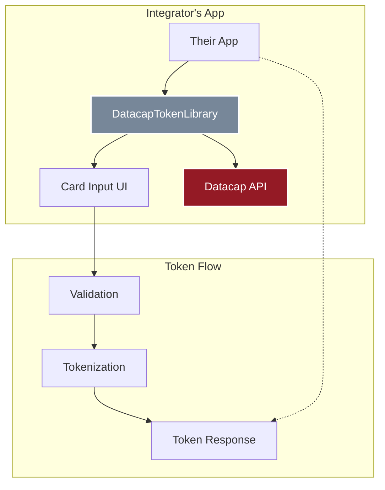
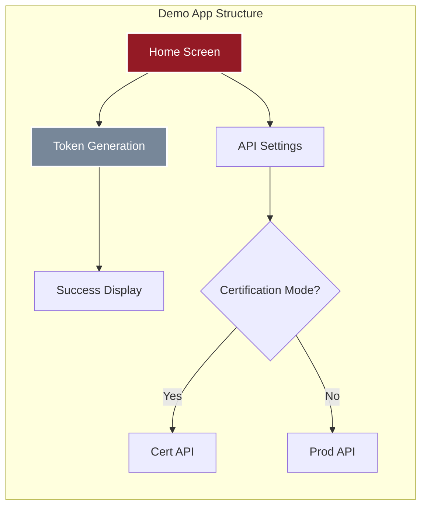
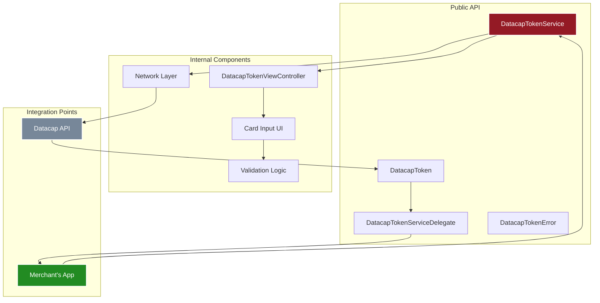
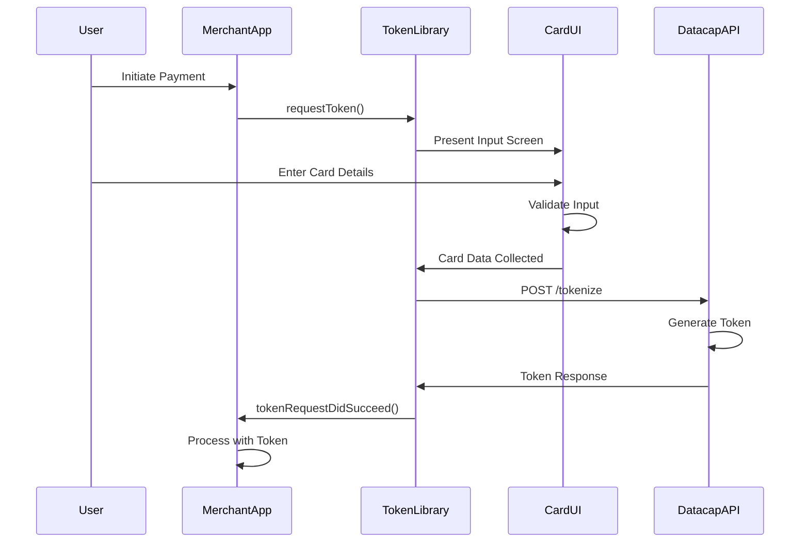
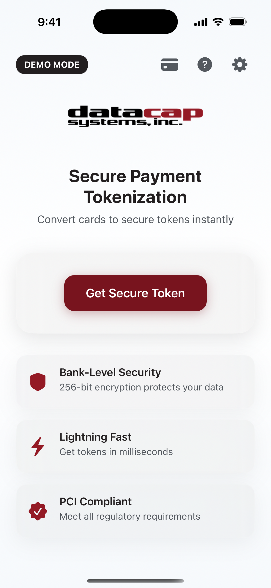
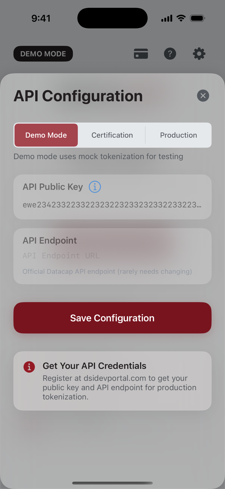
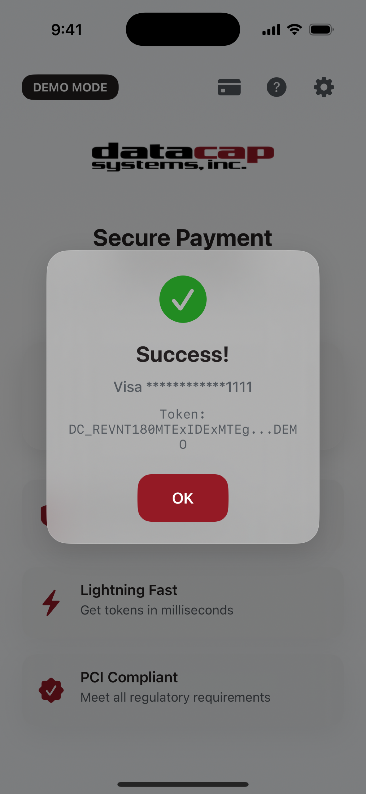

# Datacap MobileToken iOS Library 🚀

<div align="center">
  
  
  [](https://www.apple.com/ios/)
  [](https://swift.org/)
  [](https://developer.apple.com/xcode/)
  [](LICENSE)
</div>

## 🚀 Overview

This repository contains both a **production-ready iOS tokenization library** and a **demo application** showcasing Datacap's payment tokenization capabilities. The library provides secure payment card tokenization for iOS applications, perfect for developers integrating payment processing into their apps.

**Latest Update (v2.0)**: Completely refactored as a clean, reusable SDK with no mock functionality. The demo app now serves as a reference implementation for developers.

**Recent UI Improvements**:
- Enhanced help overlay with scrollable content and better readability
- Enlarged Generate Token button for better user experience
- Updated App Store positioning as developer tool
- Improved visual consistency across all UI elements

## 📁 Repository Structure

```
Datacap-MobileToken-iOS-2025/
├── DatacapTokenLibrary/        # 📦 Distributable library for integrators
│   ├── Sources/                # Core library code
│   ├── Example/                # Integration examples
│   └── README.md               # Library-specific documentation
├── DatacapMobileTokenDemo/     # 📱 Demo application
│   ├── DatacapMobileDemo/      # Demo app source code
│   └── *.xcodeproj             # Xcode project
└── Documentation/              # 📚 Additional docs
```

## 🎯 What's Included

### 1. DatacapTokenLibrary (For Integrators)

A clean, reusable library that integrators can add to their iOS apps:



**Quick Integration:**
```swift
// Initialize with merchant's public key
let tokenService = DatacapTokenService(
    publicKey: "MERCHANT_PUBLIC_KEY",
    isCertification: true
)

// Request token
tokenService.requestToken(from: self)
```

### 2. Demo Application

A complete iOS app demonstrating the library in action:



## 🏗️ Architecture

### Library Architecture



### Token Generation Flow



## 🎨 Key Features

### For Integrators (Library) - v2.0
- 🔐 **Production-Ready**: No mock data, real API integration only
- 📱 **Complete UI Package**: Pre-built card input with validation
- ✅ **Zero Dependencies**: Standalone library with no external requirements
- 🎯 **Simple Integration**: Initialize, present, receive token
- 🌐 **Dual Environment**: Certification (testing) and production modes
- 📦 **Multiple Distribution**: SPM, CocoaPods, or manual integration

### For Developers (Demo App)
- 🎨 **Reference Implementation**: See exactly how to integrate the SDK
- ⚙️ **API Configuration**: Test with your merchant credentials
- 💳 **Smart Card Detection**: Automatic BIN-based card identification
- 📅 **Native Date Picker**: iOS wheel-style expiration selection
- 🔄 **Real-time Formatting**: Dynamic card number formatting by type
- ❓ **Comprehensive Help System**: Scrollable overlay with SDK documentation, test cards, and code examples

## 📱 Screenshots

<div align="center">
  <table>
    <tr>
      <td align="center">
        
        <br><b>Home Screen</b>
      </td>
      <td align="center">
        
        <br><b>API Configuration</b>
      </td>
      <td align="center">
        
        <br><b>Card Input UI</b>
      </td>
    </tr>
  </table>
</div>

## 🛠️ Installation

### For Integrators (Using the Library)

#### Swift Package Manager
```swift
dependencies: [
    .package(url: "https://github.com/datacapsystems/DatacapTokenLibrary-iOS.git", from: "1.0.0")
]
```

#### CocoaPods
```ruby
pod 'DatacapTokenLibrary', '~> 1.0'
```

#### Manual Installation
1. Copy `DatacapTokenLibrary/Sources/` to your project
2. Add files to your target
3. Import and use

### For Developers (Running the Demo)

```bash
# Clone the repository
git clone git@github.com:datacapsystems/Datacap-MobileToken-iOS-2025.git
cd Datacap-MobileToken-iOS-2025

# Open in Xcode
open DatacapMobileTokenDemo/DatacapMobileTokenDemo.xcodeproj

# Build and run (⌘+R)
```

## 💻 Integration Guide

### Basic Usage

```swift
import DatacapTokenLibrary

class PaymentViewController: UIViewController {
    
    let tokenService = DatacapTokenService(
        publicKey: "YOUR_MERCHANT_PUBLIC_KEY",
        isCertification: true  // false for production
    )
    
    override func viewDidLoad() {
        super.viewDidLoad()
        tokenService.delegate = self
    }
    
    @IBAction func addCardTapped() {
        tokenService.requestToken(from: self)
    }
}

extension PaymentViewController: DatacapTokenServiceDelegate {
    func tokenRequestDidSucceed(_ token: DatacapToken) {
        // Success! Send token to your backend
        print("Token: \(token.token)")
    }
    
    func tokenRequestDidFail(error: DatacapTokenError) {
        // Handle error
        print("Error: \(error.localizedDescription)")
    }
    
    func tokenRequestDidCancel() {
        // User cancelled
    }
}
```

## 🔧 Configuration

### API Credentials

1. Get your merchant account at [dsidevportal.com](https://www.dsidevportal.com)
2. Obtain your public API key
3. Initialize the library with your key
4. Start with certification mode for testing

### Supported Card Types

| Card Type | Length | Starting Digits | CVV Length |
|-----------|--------|----------------|------------|
| Visa | 16 | 4 | 3 |
| Mastercard | 16 | 51-55, 2221-2720 | 3 |
| American Express | 15 | 34, 37 | 4 |
| Discover | 16 | 6011, 65, 644-649 | 3 |
| Diners Club | 14 | 36, 38, 300-305 | 3 |

## 💳 Testing

### Test Card Numbers

Use these in certification mode:

```
Visa:         4111111111111111  CVV: 123
Mastercard:   5555555555554444  CVV: 123
Amex:         378282246310005   CVV: 1234
Discover:     6011111111111117  CVV: 123
```

## 🔐 Security

- **No Card Storage**: Card data is never persisted
- **HTTPS Only**: All API calls use TLS encryption
- **PCI Compliant**: Follows all security best practices
- **Input Validation**: Real-time Luhn validation
- **Secure Entry**: CVV field is always masked

## 📚 Documentation

- [Library Integration Guide](DatacapTokenLibrary/README.md)
- [API Documentation](https://docs.datacapsystems.com)
- [Developer Portal](https://www.dsidevportal.com)
- [Support](mailto:support@datacapsystems.com)

## 🚀 Building & Deployment

### Build Library
```bash
cd DatacapTokenLibrary
swift build
```

### Build Demo App
```bash
xcodebuild -project DatacapMobileTokenDemo/DatacapMobileTokenDemo.xcodeproj \
  -scheme DatacapMobileTokenDemo \
  -destination 'platform=iOS Simulator,name=iPhone 16 Pro' \
  build
```

## 📄 License

This project contains both commercial and demo components:
- **Library**: Commercial license (see [DatacapTokenLibrary/LICENSE](DatacapTokenLibrary/LICENSE))
- **Demo App**: MIT license for reference implementation

## 🤝 Support

For technical support and questions:
- Email: support@datacapsystems.com
- Documentation: https://docs.datacapsystems.com
- Issues: [GitHub Issues](https://github.com/datacapsystems/Datacap-MobileToken-iOS-2025/issues)

---

<div align="center">
  <p>Built with ❤️ by <a href="https://datacapsystems.com">Datacap Systems</a></p>
  <p>© 2025 Datacap Systems, Inc. All rights reserved.</p>
</div>