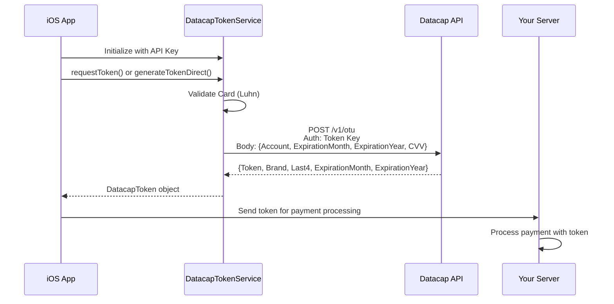

# Datacap MobileToken iOS SDK 🚀

<div align="center">
  
  
  [](https://www.apple.com/ios/)
  [](https://swift.org/)
  [](https://developer.apple.com/xcode/)
  [](https://docs.datacapsystems.com)
  [](LICENSE)
</div>

## 🎯 Overview

Production-ready iOS SDK for Datacap payment tokenization. This repository provides everything ISVs and merchants need to integrate secure, PCI-compliant payment tokenization into their iOS applications.

### ✨ Latest Updates (v2.0 - 2025)

- **🔐 Real API Integration**: Direct REST API implementation using Datacap's OTU (One-Time-Use) endpoints
- **🔑 Dual Key Support**: Separate API keys for certification and production environments
- **📱 Modern UI**: iOS 26 Liquid Glass design system with programmatic UI
- **🛠️ ISV Ready**: Clean, self-contained service class for easy integration
- **✅ Production Tested**: Verified against live Datacap tokenization endpoints

## 📁 Repository Structure

```
Datacap-MobileToken-iOS-2025/
├── DatacapTokenLibrary/        # 📦 Ready-to-use SDK for integrators
│   ├── Sources/                # DatacapTokenService.swift
│   └── README.md               # Quick integration guide
├── DatacapMobileTokenDemo/     # 📱 Reference implementation
│   ├── DatacapMobileDemo/      # Demo app with UI examples
│   └── *.xcodeproj             # Xcode project
├── INTEGRATION_GUIDE.md        # 📚 Detailed integration instructions
├── CLAUDE.md                   # 🤖 AI assistant reference
└── Scripts/                    # 🛠️ Build and deployment tools
```

## 🏗️ Architecture

### SDK Architecture

```mermaid
graph TB
    subgraph "Your iOS App"
        APP[Your App] --> SDK[DatacapTokenService]
        SDK --> |"Option 1"| UI[Built-in Card UI]
        SDK --> |"Option 2"| CUSTOM[Your Custom UI]
    end
    
    subgraph "Datacap API"
        SDK --> AUTH[Authorization Header]
        AUTH --> |"POST"| OTU[/v1/otu Endpoint]
        OTU --> TOKEN[Secure Token]
    end
    
    subgraph "Response"
        TOKEN --> |"Success"| RESP[Token + Card Details]
        TOKEN --> |"Error"| ERR[Error Message]
    end
    
    style SDK fill:#941a25,stroke:#fff,stroke-width:2px,color:#fff
    style OTU fill:#228b22,stroke:#fff,stroke-width:2px,color:#fff
    style APP fill:#778799,stroke:#fff,stroke-width:2px,color:#fff
```

### API Integration Flow



### Dual Environment Support


## 🚀 Quick Start

### 1. Copy the SDK
```bash
cp DatacapTokenLibrary/Sources/DatacapTokenService.swift YourProject/
```

### 2. Initialize Service
```swift
import UIKit

class PaymentViewController: UIViewController {
    private var tokenService: DatacapTokenService!
    
    override func viewDidLoad() {
        super.viewDidLoad()
        
        tokenService = DatacapTokenService(
            publicKey: "YOUR_TOKEN_KEY",
            isCertification: true  // false for production
        )
        tokenService.delegate = self
    }
}
```

### 3. Generate Token
```swift
// Option 1: Use built-in UI
@IBAction func payButtonTapped() {
    tokenService.requestToken(from: self)
}

// Option 2: Use your own UI
let cardData = CardData(
    cardNumber: "4111111111111111",
    expirationMonth: "12",
    expirationYear: "25",
    cvv: "123"
)

Task {
    do {
        let token = try await tokenService.generateTokenDirect(for: cardData)
        // Process payment with token
    } catch {
        // Handle error
    }
}
```

### 4. Handle Response
```swift
extension PaymentViewController: DatacapTokenServiceDelegate {
    func tokenRequestDidSucceed(_ token: DatacapToken) {
        print("Token: \(token.token)")
        print("Card: \(token.maskedCardNumber)")
        print("Type: \(token.cardType)")
        // Send token to your server
    }
    
    func tokenRequestDidFail(error: DatacapTokenError) {
        // Handle error
    }
    
    func tokenRequestDidCancel() {
        // User cancelled
    }
}
```

## 🎨 Key Features

### SDK Features
- **🔐 Real API Integration**: Direct REST API calls to Datacap's OTU endpoints
- **🔑 Dual Key Support**: Separate keys for certification and production
- **📱 Two Integration Modes**: Built-in UI or bring your own
- **✅ Card Validation**: Luhn algorithm, BIN detection, format validation
- **🎯 Zero Dependencies**: Pure Swift, no external libraries
- **📦 Easy Integration**: Single file to add to your project

### Demo App Features
- **🎨 Modern UI**: iOS 26 Liquid Glass design system
- **⚙️ Settings Management**: Configure and test both environments
- **💳 Smart Card Entry**: Auto-formatting, type detection
- **📅 Native Date Picker**: Wheel-style expiration selection
- **🔄 Live Validation**: Real-time feedback as you type
- **📋 Token Display**: Copy token with one tap

## 🛠️ API Documentation

### Endpoints
- **Certification**: `https://token-cert.dcap.com/v1/otu`
- **Production**: `https://token.dcap.com/v1/otu`

### Request Format
```http
POST /v1/otu
Authorization: {your-token-key}
Content-Type: application/json

{
    "Account": "4111111111111111",
    "ExpirationMonth": "12",
    "ExpirationYear": "25",
    "CVV": "123"
}
```

### Response Format
```json
{
    "Token": "DC4:AAAMbdJpMn6wZYlx84etCekz...",
    "Brand": "Visa",
    "ExpirationMonth": "12",
    "ExpirationYear": "2025",
    "Last4": "1111",
    "Bin": "411111"
}
```

## 💳 Test Cards

Use these in certification mode:

| Card Type | Number | CVV | Exp |
|-----------|--------|-----|-----|
| Visa | 4111111111111111 | 123 | Any future date |
| Mastercard | 5555555555554444 | 123 | Any future date |
| Amex | 378282246310005 | 1234 | Any future date |
| Discover | 6011111111111117 | 123 | Any future date |
| Diners | 36700102000000 | 123 | Any future date |

## 🔐 Security

- **PCI Compliant**: No card data storage, tokenization only
- **TLS Encryption**: All API calls use HTTPS
- **Input Validation**: Luhn algorithm, BIN validation
- **Secure Entry**: Masked CVV input
- **One-Time Tokens**: Tokens are single-use only

## 🚀 Running the Demo

```bash
# Clone repository
git clone https://github.com/datacapsystems/Datacap-MobileToken-iOS-2025.git
cd Datacap-MobileToken-iOS-2025

# Open in Xcode
open DatacapMobileTokenDemo/DatacapMobileTokenDemo.xcodeproj

# Build and run (⌘+R)
```

### Demo Configuration
1. Launch app
2. Tap Settings (gear icon)
3. Select Certification mode
4. Enter your test API key
5. Save configuration
6. Tap "Generate Token"

## 📱 Requirements

- iOS 15.6+
- Xcode 16.0+
- Swift 5.0+
- Network connectivity

## 🤝 Support

- **Documentation**: [docs.datacapsystems.com](https://docs.datacapsystems.com)
- **Developer Portal**: [dsidevportal.com](https://www.dsidevportal.com)
- **Email**: support@datacapsystems.com
- **GitHub Issues**: [Report bugs here](https://github.com/datacapsystems/Datacap-MobileToken-iOS-2025/issues)

## 📄 License

This is commercial software. Contact Datacap Systems for licensing information.

---

<div align="center">
  <b>Built with ❤️ by Datacap Systems</b><br>
  <i>Secure Payment Solutions Since 1983</i>
</div>
